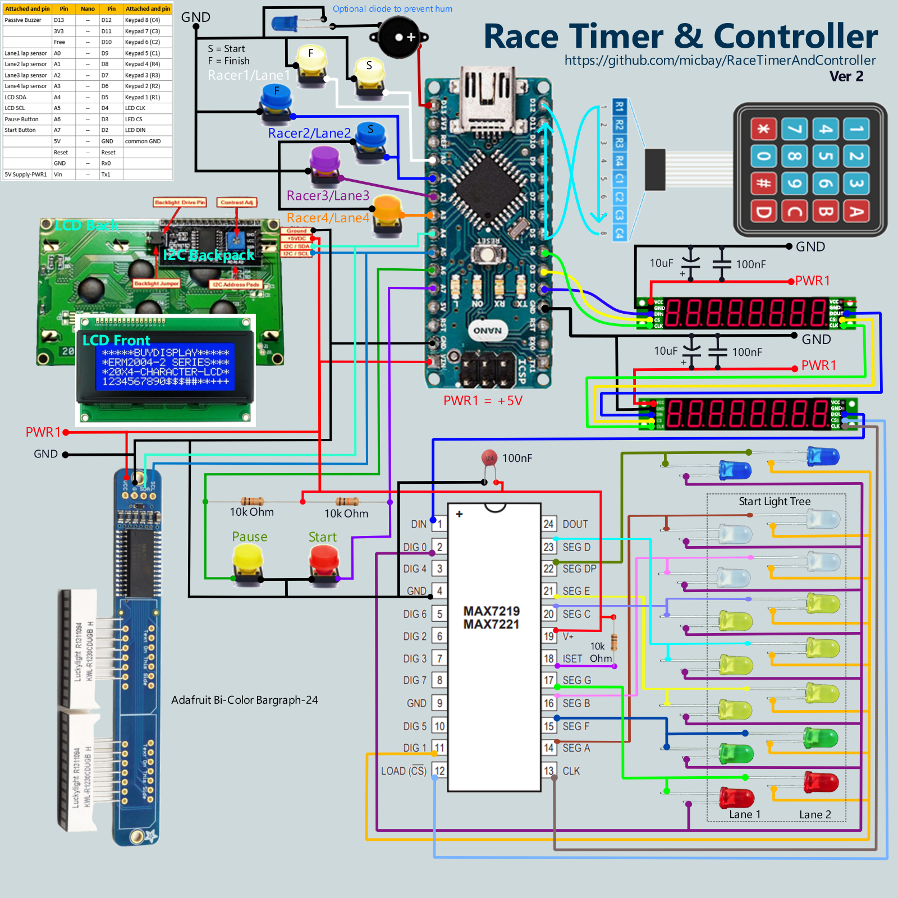
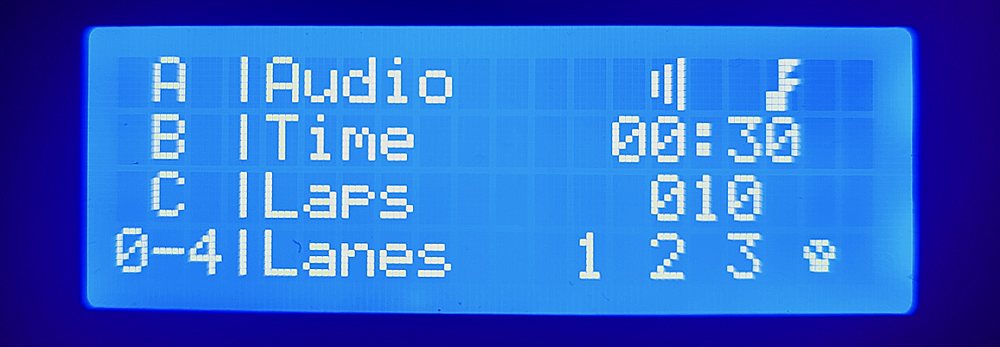
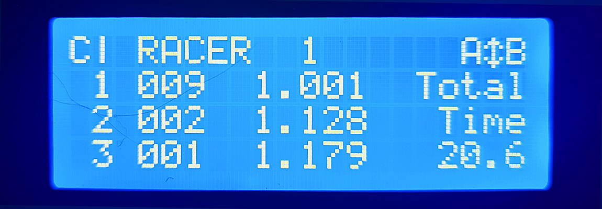
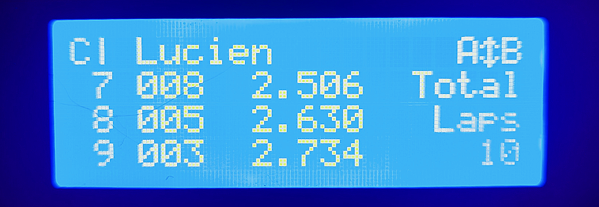
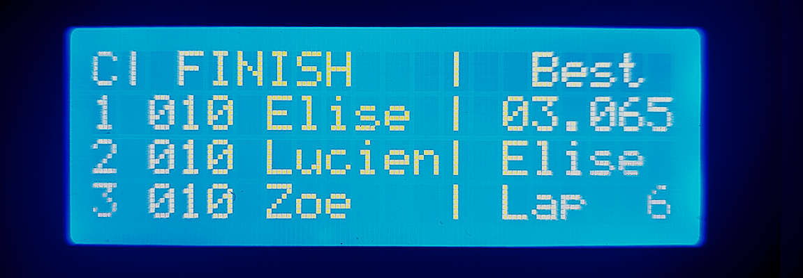

# **Arduino Race Timer and Lap Gate Controller**
Download this repository into a local folder with the same name as the contained `.ino` to use as an Arduino sketch.

### [This video](https://youtu.be/n0GLdoQ6pg4) provides a live use demonstration of the example implementation hardware.
NOTE: the video demo is of an earlier version of the system. With the release of V2.X, many new features have been added that are not demonstrated in the video, including start lights, drag racing mode, a race pre-stage step, and other user customizations of race parameters.


---
## Table of Contents
1. [Introduction](#introduction)
    - [Prerequisites](#prerequisites) 
2. [Hardware Configuration](#hardware-configuration)
    - [Wiring Diagram](#wiring-diagram)
    - [Pin Out for Arduino Nano](#pinout-for-wiring-arduino-nano)
    - [Adjustments for Using ATMega2560 Based Arduino Instead](#changes-if-using-atmega2560-microcontroller-based-module)
3. [Software Configuration](#software-configuration)
4. [The Main Display (LCD2004 + I2C Backpack)](#main-display)
    - [Creating Custom Characters](#custom-characters)
5. [Racer Lap Timers (8-digit, 7-seg LED Bar)](#lap-timers)
6. [DIY MAX7219 Based Start Light Tree](#diy-max7219-based-start-light-tree)
7. [Adafruit Bi-Color Bargraph-24 as a Start Light](#adafruit-bi-color-bargraph-24-as-a-start-light)
8. [The Keypad](#the-keypad)
9. [Lap/Gate Sensing](#gate-sensing)
10. [Sensor Options](#sensor-options)
11. [Analog Pause and Start Buttons](#analog-pause--start-buttons)
12. [Playing Audio](#playing-audio)
     - [Songs & Melodies](#songs--melodies)
     - [Method 1](#method-1-notes--lengths-arrays--pitchesh) - Using `Notes[]` and `Lengths[]` arrays
     - [Method 2](#method-2-ringtone-rtttl-format) - Using RTTTL Ringtones
13. [Audio Modes](#audio-modes)
14. [Race Controller Operation](#race-controller-operation)
    - [Main Menu Navigation](#main-menu-navigation)
    - [Racing](#racing)
15. [Drag Race Start Light Indicators](#drag-race-start-light-indicators)
16. [Customizing UI Text and General Controller Settings](#customizing-ui-text-and-general-controller-settings)

<br>

# **Introduction**
This is an Arduino based project that implements an inexpensive, reliable, race game controller that can be used for timed racing games of 1-4 racers. The system consists of a main LCD display, a keypad for user input and menu selection, an 8 digit LED lap count & timer display for each racer, and non-blocking audio for UI feedback and playing a unique victory song for each racer.

Optionally, V2.0 and higher supports using an Adafruit 24 Bi-Color LED bargraph or MAX7219 based, custom LED tree, as starting lights and race status indicators.

In the presented configuration, the lap sensing input is simulated using buttons, but can be adapted to be used with a myriad of simple, circuit completion, or other type sensing methods that can be implemented in the physical lap gate. The working demo of this project uses two paper clips integrated into a mechanical lap counter to create a simple, yet effective lap sensor.

See [Race Controller Operation](#Race-Controller-Operation) at the end of this document for menu navigation and general use.

  
  
  

The original application for this controller was slot car racing, as such, the controller was designed expecting a dedicated lane/gate for each racer. The down side of this, if attempting to adapt for drone racing, is that each racer needs a dedicated gate, but in turn, this also means that the racing object is irrelevant and does not need to communicate its identity.
> ***Code Snippets in Readme** - the code snippets shown in this readme file are not meant to be cut and paste working examples. They are used only to illustrate the syntax for general setup and usage. For working code, reference the releated sections of the actual project code in `RaceTimerAndController.ino`*  
> ***Note on Reference Sources** - All links are for reference only and are not to be taken as an endorsement of any particular component supplier. I attempt to reference official Arduino resources whenever possible, but this is also not an endorsement for or against using the Arduino store.*

### **Prerequisites**  <a id="prerequisites"></a>
This project involves a lot of different hardware and software concepts, and implements some more intermediate to advanced code for Arduino.

However, I have endeavored to explain in enough detail that someone with almost no experience can still follow along, and successfully build a working controller. It will even be possible to customize menu text and default game settings, without having to write new code.

It is expected the reader understands how to use the Arduino IDE, connect wires, and program boards. To get up to speed on those basics, please check out, [Getting Started With Arduino Projects](https://www.arduino.cc/en/Guide), or many other great resources around the web.

<br>

# **Hardware Configuration**  
All of the components are readily available and can be connected with basic jumper leads or simple conductors (wires). Some components might require header pin soldering if they do not come pre-assembled.
> ***Note on Housing and Mechanical Interface** - This project only documents the functional electrical and software configuration. It can be wired, and used as illustrated for demonstration, however, for repeated, practical usage, the construction of a permanent housing, and mechanical trigger interface, is left up to the implementer to develop per their unique setup.*  

## **Parts for Core Race Controller**
The parts required for the base system are listed below. These will support all race modes. For drag racing, the 7-sement, racer lap timer displays, for lanes 1 & 2, will update for each pre-start interval that is typically found on a start light tree.
- [Arduino Nano](https://docs.arduino.cc/hardware/nano) (or equivalent ATMega328 based microcontroller module) ([amazon search](https://www.amazon.com/arduino-nano/s?k=arduino+nano))
  - if using Mega2560 adjust code and wiring per annotations)
- [4 x 4 membrane keypad](https://duckduckgo.com/?q=4+x+4+membrane+keypad)
- [LCD2004 4 row x 20 character display](https://duckduckgo.com/?q=LCD2004A+4+x+20+I2C+backpack), with [I2C backpack](https://www.mantech.co.za/datasheets/products/LCD2004-i2c.pdf)
- 2-4 Chainable, [8-digit, 7-segment LED bar with integrated MAX7219](https://duckduckgo.com/?q=8-digit%2C+7-segment+LED+display)
- Passive Buzzer or speaker
  - The 7-seg LEDs induced a hum on my buzzer, I used a diode on one lead to eliminate it.
- 2-4 Analog or digital lap sensors/switches/buttons, 1 for each lane.
    - (optional) +2 drag race finish sensors - Drag racing can be setup to use just a finish sensor, however, to support the default start & finish drag sensing, add 2 more sensors that will share the same pins as the start sensors for lanes 1 & 2.
- 2 momentary switches for a 'Pause' and optional 'Start' button.
  - 10k Ohm Pull-Up resistor to adapt button for analog input on A6
- Jumper leads to wire connections between peripherals & Arduino

### **Supported Start Light Configurations**
Starting with Ver2.0, this controller will support using an Adafruit Bi-color Bargraph-24, and/or, a custom built LED light tree that can be assembled using standard LED components and a MAX7219 serial dirver.

### Custom Start Light Tree Parts
These are all the parts required to build a custom start light tree. For further details, see section: [DIY MAX7219 Based Start Light Tree](#diy-max7219-based-start-light-tree).
- [MAX7219 Serial LED driver chip](https://www.amazon.com/Bridgold-MAX7219CNG-MAX7219-Serially-Interfaced/dp/B0BK6XC4P8/ref=sr_1_3?keywords=max7219&sr=8-3) - ([datasheet](https://www.analog.com/media/en/technical-documentation/data-sheets/MAX7219-MAX7221.pdf)) same chip used by the pre-packaged LED bars.
- 4 White LEDs
- 6 Yellow LEDs
- 2 Green LEDs
- 2 Red LEDs
- 2 Blue LEDs
- 100nF (i.e. 0.1μF, #104) capacitor
- 10k Ohm Resistor

### Adafruit Start Light Parts
- [Adafruit Bi-Color Bargraph-24, With I2C backpack kit](https://www.adafruit.com/product/1721) - This is an I2C compatible, full assembly of an LED light bar with 24 segments. Each segment has a Green, and a Red, LED, which can be lit to create red, yellow, or green.


## **PinOut for Wiring Arduino Nano**
(these are the pins used by this code, but can be re-arranged, if desired)  
<div style="color:orange;font-size:12px">  

|Attached        |Pin  |Nano|Pin  |Attached        |
|---------------:|----:|:--:|-----|----------------|
|Passive Buzzer  |D13  |\-- |D12  |Keypad 8 (C4)   |
|                |3V3  |\-- |D11  |Keypad 7 (C3)   |
|                |Free |\-- |D10  |Keypad 6 (C2)   |
|Lane1 lap sensor|A0   |\-- |D9   |Keypad 5 (C1)   |
|Lane2 lap sensor|A1   |\-- |D8   |Keypad 4 (R4)   |
|Lane3 lap sensor|A2   |\-- |D7   |Keypad 3 (R3)   |
|Lane4 lap sensor|A3   |\-- |D6   |Keypad 2 (R2)   |
|LCD/Bargraph SDA|A4   |\-- |D5   |Keypad 1 (R1)   |
|LCD/Bargraph SCL|A5   |\-- |D4   |LED CLK         |
|Pause Button    |A6   |\-- |D3   |LED CS          |
|Start Button    |A7   |\-- |D2   |LED DIN         |
|                |5V   |\-- |GND  |common GND      |
|                |Reset|\-- |Reset|                |
|common GND      |GND  |\-- |Rx0  |                |
|+5V Supply      |Vin  |\-- |Tx1  |                |
</div>  

## **Wiring Diagram**


## **Changes if Using ATMega2560 Microcontroller Based Module**
By default the code is setup for an Arduino Nano, ATMega328 based pin out. However, with minor adjustments, this project can also work with modules, like the Arduino Mega2560, that use an ATmega2560 processor. To switch between using a ATMega328 and ATMega2560, one can edit the hardware variables referenced in the `localSettings.h` file.

The summary of the changes to be made to use a Mega2560 board are:
- Use pins `D20` & `D21` for LCD's SDA and SCL (respectively), instead of `A4` & `A5`.
- For the lane sensors, use pins on I/O `port K` instead of `port C`.
  - Wire lanes1-4 to pins A8-A11 instead of pins A0-A3
  - Edit setting `PCINT_VECT` in the `localSettings.h` file, to change interrupt vector used to be `PCINT2_vect`, instead of `PCINT1_vect`.
  - and accordingly, edit setting `INTERRUPT_PORT` in the `localSettings.h` file, to read from the port K byte, `PINK`, instead of port C byte, `PINC`, to check triggered lanes.

## **Power Supply (+5V)**  
All devices in this build are powered from a +5V source. The displays should draw power from the source supply and not through the Arduino which cannot support enough current to run everything without flickering.

> ***Powering MAX7219 LED Bars** - Power for these can be daisy chained for the first 2 bars, but cascading 3 or more may require running the power directly to each subsequent display bar, but always keep all the signal lines daisy chained.*

> ***<span style="color:yellow"> Connect Arduino GND to external ground reference </span>** - Like many projects with higher power demands, this one uses an external power supply to get enough current for operation; during development and programming, we will often have the computer USB plugged in as well, which also serves as a power supply. Sometimes the computer might be using battery and sometimes it may be using wall power, this can change the ground reference of the USB with respect to the other power sources. If one is not careful, one may create a ground reference mismatch. To avoid this we should jumper all common input supply grounds into the Arduino. Ground reference mismatch can cause intermittent errors, or the device to not work at all.  
> 
> If we were to inadvertently find ourselves with the configuration shown here. It may appear to be ok on first look, but with the multi-meter we can see that there is a 1.9V differential between the two ground references when it should be reading close to 0.*
> 
> 
> Connecting our grounds to bring them to the same potential, as below, will eliminate the problem above.  
> 
> 
 
<br>

# **Software Configuration**  
In order to interact with our different peripherals, this project uses several existing [Arduino libraries](https://www.arduino.cc/reference/en/libraries/). Unless otherwise specified, these libraries can be downloaded the usual manner using the [Arduino Library Manager](https://docs.arduino.cc/software/ide-v1/tutorials/installing-libraries). Each library will be introduced with the hardware it's related to.

Reference for add-on libraries used in the core project. The versions listed are the latest, verified compatible versions. If newer versions are causing a compiling issue, try the version listed below:
- [hd44780](https://www.arduino.cc/reference/en/libraries/hd44780/) v1.3.2
- [LedControl](https://www.arduino.cc/reference/en/libraries/ledcontrol/) v1.0.6
- [Keypad](https://www.arduino.cc/reference/en/libraries/keypad/) v3.1.1
- [PlayRtttl](https://github.com/ArminJo/PlayRtttl) v1.4.2 (at the time of this edit, it is known version 2.x+ of this library are currently NOT compatible with this project, please make sure to install V1.4.2)
- ^ [Adafruit GFX](https://www.arduino.cc/reference/en/libraries/adafruit-gfx-library/) 1.11.5
- ^ [Adafruit LED Backpack](https://www.arduino.cc/reference/en/libraries/adafruit-led-backpack-library/) 1.3.2

^ These libraries are only necessary to support the Adafruit Bargraph. However they must still be installed, even if not using them, to avoid any compiling errors.

All custom project logic is in the main Arduino `.ino` sketch file. The additional supporting `.h` files are used to store different data constants defining custom characters, songs, and default system settings.
- `RaceTimerAndController.ino` - main sketch file containing all custom logic
- `enum_list.h` - all defined enums are put in a seperate file to force the compiler to handle them before they are used as a global function parameter. Not doing so can cause a compiler error, even though the code is ok.
- `RTTL_songs.h` - file to hold RTTL song string constants
- `melodies_prog.h` - file to hold Notes[] Lengths[] array based song data
- `pitches.h` - file holding `#define` macros setting the frequency values used for Notes array based songs.
- `CustomChars.h` - file holding byte array constants that define the shape of custom icons used in this project.
- `defaultSettings.h` - file holding `#define` macros that establish the values used for the default controller UI text and race settings.
- `example.localSettings.h` - file to be copied and used as base file for generating a `localSettings.h`, used to override `defaultSettings.h` for the local use environment.
- `README.md` - Project documentation text, written in markdown format.
- `CHANGE_LOG.md` - Project change record, written in markdown format.

The game controller code uses non-blocking techniques with port register interrupts on the lap detection sensor pins.

<br>

# **The Main Display (LCD2004 + I2C Backpack)** <a id="main-display"></a>

For the main display that provides the user interface, the project uses a 4 row x 20 character LCD. LCD character displays are readily available in 2 or 4 rows, of 16 or 20 characters, fairly inexpensive, and simple to use. A 4 row x 20 character LCD display is the biggest commonly available, and is big enough to fit understandable menus and output for this application.  
In addition to providing the setup interface, the main display will also display a live leaderboard during a race. However, it's much too small to be used as a spectator display from a distance.

> ***LCD Part Numbers:** these types of character LCDs usually follow a Part Number pattern of 'LCDccrr', where rr = number of rows, and cc = the number of characters wide it is. (ie. LCD2004 = 4rows of 20ch).*

This display can be controlled directly using 13 Arduino pins. Though, it is common to add a small 'backpack' board that will allow us to control it via I2C instead. This reduces the number of signal pins from 13 to just 2. This addition is so prevalent that most LCDs of this type, sold for use with Arduino, have an I2C backpack included.

[](https://www.mantech.co.za/datasheets/products/LCD2004-i2c.pdf)

> *Though a deeper understanding isn't necessary to use I2C in this project, one may find it helpful for troubleshooting, or if modifying the project hardware or software. These references can provide more details regarding I2C, and using the built-in Arduino 'Wire' library.*
> - [I2C Basics](https://rheingoldheavy.com/i2c-basics/) 
> - [The Arduino Wire Library](https://rheingoldheavy.com/arduino-wire-library/)

## **LCD Libraries and Initialization in Code:**  
In order to interact with the LCD screen, and update what is written, we are using the `hd44780` lcd library. This is a drop in replacement for the very common `LiquidCrystal` library. Since we are using an I2C backpack we must also include the built-in Arduino `Wire` library to manage the I2C communication.

  - [Wire](https://www.arduino.cc/en/Reference/Wire) - Built-in Arduino library used to setup and control I2C communication.
  - [hd44780](https://www.arduino.cc/reference/en/libraries/hd44780/) - Of the many available, we have chosen `hd44780` as our LCD display driver and API.  
    - `hd44780_I2Cexp.h` - Because we are using an LCD with an I2C backpack we need to also include the *hd44780_I2Cexp.h* io class which is installed with the *hd44780* library.

Declaration and Setup of LCD display in `RaceTimerAndController.ino`
```cpp
// The 'Wire' library is for I2C, and is included in the Arduino installation.
// Specific implementation is determined by the board selected in Arduino IDE.
#include <Wire.h>
// LCD driver libraries
#include <hd44780.h>						// main hd44780 header
#include <hd44780ioClass/hd44780_I2Cexp.h>	// i/o class for i2c backpack

//***** Variables for LCD 4x20 Display **********
// This display communicates using I2C via the SCL and SDA pins,
// which are dedicated by the hardware and cannot be changed by software.
// If using Arduino Nano, wire pin A4 for SDA, & pin A5 for SCL.
// If using Arduino Mega2560, wire pin D20 for SDA, & pin D21 for SCL.
// Make sure the lcd is wired accordingly

// Declare 'lcd' object representing display using class 'hd44780_I2Cexp'
// because we are using the i2c i/o expander backpack (PCF8574 or MCP23008)

hd44780_I2Cexp lcd;

// Constants to set display size
const byte LCD_COLS = 20;
const byte LCD_ROWS = 4;


void setup(){
  --- other code ---
  // --- SETUP LCD DIPSLAY -----------------------------
  // Initialize LCD with begin() which will return zero on success.
  // Non-zero failure status codes are defined in <hd44780.h>
  int status = lcd.begin(LCD_COLS, LCD_ROWS);
  // If display initialization fails, trigger onboard error LED if exists.
  if(status) hd44780::fatalError(status);
  // Clear display of any residual data, ensure it starts in a blank state
  lcd.clear();
  --- other code ---
}

void loop(){
  --- other code ---

  // NOTE: normally this code would go into a function, that
  //     would only be called as necessary from the main loop.

  // To write to the lcd, set the cursor position (col#, row#)
  lcd.setCursor(0, 0);
  // Then print the characrters or numbers
  lcd.print("Text to write");

  --- other code ---
}
```

<br>

## **Custom Characters**  
This project makes use of some custom 'icons' in the menu screen. To draw them, we'll use the custom character feature of the `h78844` display library, we're using for the LCD. This library provides support for up to 8 custom characters.  

To create a custom character, define a byte array that establishes the pixels of the LCD character that are turned on, or off. This online [LCD Custom Character Generator](https://maxpromer.github.io/LCD-Character-Creator/) makes it easy to get the array and supporting code.

<table>
<tr>
<td>
  <pre>
  byte Skull[] = {
    B00000,
    B01110,
    B10101,
    B11011,
    B01110,
    B01110,
    B00000,
    B00000
  };</pre>
</td>
<td>
  
</td>
</tr>
</table>

```cpp
  // With lcd object and byte array created, create character by assigning
  // the byte array to one of the 8 spots, using int 0-7
void setup(){
  ---- some code ----

  lcd.createChar(3, Skull);

  ---- some code ----
}

void loop(){
  ---- some code ----

  // NOTE: normally this code would go into a function, that
  //     would only be called as necessary from the main loop.
  
  // To write custom character to lcd, call asigned number
  lcd.setCuror(0,0);
  lcd.write(3);

  ---- some code ----
}
  ```

<br>

# **Racer Lap Timers (8-digit, 7-seg LED Bar)** <a id="lap-timers"></a>

This race controller is intended to support up to 4 racers. For each racer we have a dedicated lap sensor for tracking laps. Associated with that lap sensor is a dedicated display showing the racer's active lap number and running lap time.

The display must be able to fit a 3 digit lap count and a lap time with up to 4 significant digits. With this lap time digit width, we can support a display precision of at least 1 sec up to a 1 hour lap time, and as small as 1ms for lap times under 10 seconds.

***NOTE: Display precision has no impact on the precision of the recorded lap time. Laps of all durations will be captured with millisecond precision (0.000 sec).***

> 4 significant digits, sliding lap time display precision
> | Lap Time Range | Most Precise Display Format |
> |---|--|
> | time < 10 sec | 0.000 - 9.999 |
> | 10 sec <= time < 1 min |10.00 - 59.99 |
> | 1 min <= time < 10 min | 1.00.0 - 9.59.9 |
> | 10 min <= time < 1 hour | 10.00 - 59.59|

Because the primary purpose of this display is to show numbers, a 7-segment LED is a perfect, low budget choice. A 7-seg LED digit is made up of 8 standard LEDs arranged as a digit with a decimal.

As with the LCD, we could drive each LED directly from the Arduino, however, this would quickly exceed our available pins. Each of the 8 LEDs that make up a single 7-segment digit & decimal, would need its own pin. This means to display 8 digits we would need 8 digits x 8 LEDs, or 64, pins to drive a timer display for just a single racer.

[](https://www.electroschematics.com/arduino-segment-display-counter/)

## **The MAX7219 Serial LED Driver:**
### **Use Serial LED Driver to Minimize Pin Count**  
Luckily, our pin problem can be overcome by using a chip like the [MAX7219](https://www.14core.com/wp-content/uploads/2016/03/MAX7219-MAX7221.pdf), which can drive up to 64 LEDs while requiring only 3 signal pins from the Arduino. As such, it's common to find pre-assembled 7-segment LED bars having 4, or 8 digits, with an integrated MAX7219, like the one shown here.

We'll use one of these 8 digit MAX7219 LED packages, as a lap timer, for each racer.


### **Chain The Lap Timer Displays**  
Another feature of the MAX7219, that makes these LED bars a good choice for this application, is the ability to cascade (i.e. daisy chain) a number of them together. By taking advantage of the MAX7219's no-op register we can update any digit of any of the racer's LED bars using the same 3 signal pins from the Arduino. The LED driver library will handle the implementation details regarding this, so it's not really necessary to understand more than we can connect them together and address any given digit individually.


### **Noise Sensitivity**  
The MAX7219 can be particularly sensitive to noise on its power input. If the power lines are clean, and direct, there may not be an issue, however, the MAXIM documentation on using the [MAX7219](https://www.14core.com/wp-content/uploads/2016/03/MAX7219-MAX7221.pdf), strongly recommends using a bypass filter, consisting of a 10&mu;F (polarized, electrolytic) and 100nF (i.e. 0.1&mu;F, #104) capacitors across the input voltage into the MAX7219 and ground.

The 8-digit, 7-segment display bars I've seen usually come with the 0.1&mu;F cap already installed. Some MAX7219 application notes only use this single bypass cap. If you are experiencing odd behavior you can try adding the 10&mu;F capacitor as shown below.

For more information on why and how bypass filters work see (ref [article](https://www.electronicdesign.com/power-management/power-supply/article/21808839/3-ways-to-reduce-powersupply-noise) or [video](https://www.youtube.com/watch?v=KKjHZpNMeik)).
 
|Bypass Diagram| Capacitor Diagram Symbol Review|
|:---:|:---:|
| | [](https://www.ifixit.com/Wiki/Troubleshhoting_logic_board_components) 

> *My LED bars, like the ones picture above, came with the 100nF capacitor. If necessary, one can add a 10uF cap, in parallel, at the same solder points. If you do this, make sure to probe which end of C1 is connected to ground to get the polarity right.*   
> | 100nF Cap| Added 10uF|
> |---       |-----------|
> | | 

<br>

## LED Libraries and Initialization in Code:  
To drive the LED race timers, we will make use of the `LedControl` library which is specifically designed to operate these kinds of display packages. Similar to the LCD, this library allows us to update any given display digit with a straightforward, write number or character API.
- [LedControl](https://www.arduino.cc/reference/en/libraries/ledcontrol/) - library supports MAX7219 & MAX7221 LED displays for the LED bars.

Declaration and Setup of LED displays in `RaceTimerAndController.ino`
```cpp
// library for 7-seg LED Bars
#include <LedControl.h>

// ***** 7-Seg 8-digit LED Bars *****
const byte PIN_TO_LED_DIN = 2;
const byte PIN_TO_LED_CS = 3;
const byte PIN_TO_LED_CLK = 4;
// When more than 2 MAX7219s are chained, additional chips
// may need direct power supply to avoid intermittent error.
// # of attached max7219 controlled LED bars
const byte LED_BAR_COUNT = 4;
// # of digits on each LED bar
const byte LED_DIGITS = 8;
// LedControl parameters (DataIn, CLK, CS/LOAD, Number of Max chips (ie 8-digit bars))
LedControl lc = LedControl(PIN_TO_LED_DIN, PIN_TO_LED_CLK, PIN_TO_LED_CS, LED_BAR_COUNT);


void setup() {
  --- some other code ---
  
  // --- SETUP LED 7-SEG, 8-DIGIT MAX7219 LED BARS ------
  // Initialize all the displays
  for(int deviceID = 0; deviceID < LED_BAR_COUNT; deviceID++) {
    // The MAX72XX is in power-saving mode on startup
    lc.shutdown(deviceID, false);
    // intensity range from 0-15, higher = brighter
    lc.setIntensity(deviceID, 8);
    // Blank the LED digits
    lc.clearDisplay(deviceID);
  }

  --- some other code ---
}

void loop(){
  --- some other code ---

  // NOTE: normally this code would go into a function, that
  //     would only be called as necessary from the main loop.

  // To send a value to LED, as a character use:
  // setChar(id# of bar to update, digit position on bar, # or char to write, if to show decimal?)
  // This will write the letter 'S' to the far right digit of the 2nd, 8 digit LED bar in the chain.
  lc.setChar(1, 0, 'S', false);
  // or to send a number,
  // This will write a 4 to the 2nd digit from the right, of the 1st bar in chain.
  lc.setDigit(0, 1, 4, false);

  --- some other code ---
}

```

## **LED Display Character Writing**  
Though the primary purpose of the racer's lap displays is to show running lap counts and times, we also need to be able to identify which display is being used by which racer. The most direct way to do this is to write the racer name to the corresponding LED display on startup and racer selection.

However, a side effect of using 7-seg displays is that they cannot display all characters, and in many cases, of the characters that can be displayed, only a lower case, or upper case, option is available. 
> *7-segment displays cannot draw any version of the following characters:*  
> W's, M's, X's, K's, or V's

### **Customization of the `LedControl` Library's Character Table**  
The `LedControl` library, as it is downloaded, is missing some writable letters. To add them or to change how existing writable characters are written, we can edit the library's character table that contains the code value, representing the segments, to be displayed.

Normally it is not best practice to directly edit library files because next time they are updated these changes will get overwritten. However, in this case it is not a difficult change to re-implement vs the hassle of making our own version of the library.

> ### ***Help Finding Arduino Library Files***  
> Built-in libraries that are installed as part of the Arduino IDE, are found in the Arduino IDE installation folder in a sub-directory called `libraries`. On windows this is in:  
> - *Note that `Wire` is special and not located here.*
> ```
> Built-in:
> C:\Program Files (x86)\Arduino\libraries
> ```  
> Add-on libraries (ones installed via the library manager) such as `LedControl.h`, are found in the sketchbook folder, the same folder sketches are saved, (this folder is called 'Arduino', not 'sketchbook').  
> By default, on windows, this is found in the user's `Documents` folder:
> ```
> Add-ons:
> C:\Users\userid\Documents\Arduino\libraries
> 
> LedControl.h is found in:
> C:\Users\userid\Documents\Arduino\libraries\LedControl\src
> 
> **Replace 'userid' with appropriate windows user profile name
> ```

To edit the displayed character shape, we can edit the code value of the corresponding index of the `charTable[]` array found in `LedControl.h`. We could also use any of the unwritable characters as an alias for our own character, such as changing 'M' (i.e. ASCII 77) to be `B01001001`, which will draw a triple bar symbol when an 'M' character is commanded.

| Code Value: `B0abcdefg` | Edit `charTable[]` to update `LedControl.h` with more characters. |
|---|--|
|  | The requested character's [ASCII Value](https://www.ascii-code.com/) determines the index of the array, `charTable[]`, that has the code value, indicating which segments to light up, to draw the character. <br> For example, to set what is drawn when instructing the LED to draw a capital 'E', we look up its ASCII value, which is `69`. Then go to the value at `charTable[69]`, and set the code value to **`B01001111`**.  <br> Following the format, `B0abcdefg`, this will instruct segments a, d, e, f, and g to turn on. |

### **charTable[] from LedControl.h (modified)**
```cpp
const static byte charTable [] PROGMEM  = {
  //00  0         1         2          3        4         5         6         7
    B01111110,B00110000,B01101101,B01111001,B00110011,B01011011,B01011111,B01110000,
  //08  8         9         0         b          c        d         E         F
    B01111111,B01111011,B01110111,B00011111,B00001101,B00111101,B01001111,B01000111,
    B00000000,B00000000,B00000000,B00000000,B00000000,B00000000,B00000000,B00000000,
    B00000000,B00000000,B00000000,B00000000,B00000000,B00000000,B00000000,B00000000,
  //32                                                                        '
    B00000000,B00000000,B00000000,B00000000,B00000000,B00000000,B00000000,B00000010,
  //40                                                    -
    B00000000,B00000000,B00000000,B00000000,B10000000,B00000001,B10000000,B00000000,
  //48  0         1         2          3        4         5         6         7
    B01111110,B00110000,B01101101,B01111001,B00110011,B01011011,B01011111,B01110000,
  //56  8         9
    B01111111,B01111011,B00000000,B00000000,B00000000,B00000000,B00000000,B00000000,
  //64            A         B         C       D->d        E         F         G
    B00000000,B01110111,B01111111,B01001110,B00111101,B01001111,B01000111,B01011110,
  //72  H         I         J         K         L         M         N         O
    B00110111,B00000110,B01111100,B00000000,B00001110,B00000000,B00010101,B01111110,
  //80  P       Q->q      R->r        S       T->t        U         V         W
    B01100111,B01110011,B00000101,B01011011,B00001111,B00111110,B00000000,B00000000,
  //88  X         Y         Z         K                                       _
    B00000000,B00111011,B01101101,B00000000,B00000000,B00000000,B00000000,B00001000,
  //96          a->A        b         c         d        e        f->F        g
    B00000000,B01110111,B00011111,B00001101,B00111101,B01101111,B01000111,B01111011,
  //104 h         i         j         k         l         m         n         o
    B00010111,B00000100,B00111100,B00000000,B00000110,B00000000,B00010101,B00011101,
  //112 p         q         r       s->S        t         u         v        w
    B01100111,B01110011,B00000101,B01011011,B00001111,B00011100,B00000000,B00000000,
  //120 x         y       z->Z
    B00000000,B00111011,B01101101,B00000000,B00000000,B00000000,B00000000,B00000000
};
```

<br>

# **DIY MAX7219 Based Start Light Tree**
This project supports using a custom MAX7219 based, LED tree as a start light for circuit style, and drag style racing. By using a MAX7219 we keep this tree compatible with the SPI bus used by the 7-segment display chain, and thus will require no extra pins to integrate into the system.

The [Wiring Diagram](#wiring-diagram) for this project illustrates the wiring of this start tree for a 2 racers/lane track. If setting up a system with a different number of lanes, make sure the MAX start tree is the last device in the Racer timer LED display chain. The controller will assume that there is a timer display for each racer defined by the `LANE_COUNT` setting. If the system lane count is 3 or 4, but there are only 2 timer displays, and then the start tree, the start tree will light according to an expected 3rd racer timer display, instead of the intended pre-start countdown light.

The start tree consists of 8 LEDs for each lane. From top to bottom should be wired 7 pairs, starting with 2 white LEDs to indicate Pre-Stage, and Staged phases of a race, then 3 amber LEDs that light up for the final 3 intervals before the race start, followed by a single green LED that lights upon start. Finally a red LED pair ends the column that alerts which lane triggered a fault. 2 additional blue LEDs can be wired that indicate which lane is the winner in a drag race. By default the timing of the interval for a **circuit race** pre-start, is **1.0 sec**, and for a **drag race**, the pre-start intervals change every **0.5 sec**.

See the [Drag Racing Start Light Indicator](#drag-race-start-light-indicators) section for illustrations of the described setup.

On bootup, and while in the `Menu` state, the 3 yellow pre-start, interval lights will be lit, indicating an idle system.

)

<br>

# **Adafruit Bi-Color Bargraph-24 as a Start Light**
In place of, or addition to, a MAX7219 tree, this project also supports the use of an [Adafruit Bi-Color Bargraph-24, With I2C backpack kit](https://www.adafruit.com/product/1721) as a startlight. This start light is I2C compatible, and as such, can share the same pins as the main LCD display.

The project [Wiring Diagram](#wiring-diagram) illustrates the Bargraph integration.
  
 - This is an I2C compatible, fully assembled LED light bar with 24 segments. Each segment has a Green, and a Red, LED, which can be lit to create red, yellow, or green.


***Assembly Note:** Being diodes, the assembly orientaiton of the LEDs is important. The Adafruit Bargraph typically comes dissassembled, and requires soldering. Be sure to follow the orientation indicated by the text on the PCB and LED bars.*


<br>

# **The Keypad**
Using a full 4x4 membrane keypad is probably not needed for this project since the interface needs aren't too great, but these are readily available for only a couple dollars and facilitate an easy to use, and program, UI.
They do, however, require 8 pins, but because of our pin savings on the displays we have enough available.

<br>

## Keypad Library and Initialization in Code:  
To handle working with the keypad input, the aptly named [Keypad](https://www.arduino.cc/reference/en/libraries/keypad/) library can be used. The keypad is not on an interrupt so it needs to be poled to detect a keypress.

In this application, the game has a **Menu** state, a **Race** state and a **Paused** state.
- In the **menu** state, which is active while using the UI, we pole for a key press every loop, giving a very responsive interface.
- During a **race**, the keypad is not used so the program doesn't pole for presses.
- When a race is **paused**, it will pole for an asterisk `*`, but stop again if the race is restarted.

```cpp
// Library to support 4 x 4 keypad
#include <Keypad.h>

//***** Declare KeyPad Variables *****
// set keypad size
const int KP_COLS = 4;
const int KP_ROWS = 4;
// Layout KeyMap
char keys[KP_ROWS][KP_COLS] = {
  {'1','2','3','A'},
  {'4','5','6','B'},
  {'7','8','9','C'},
  {'*','0','#','D'}
};
// Establish the row pinouts, {Row1,Row2,Row3,Row4} => Arduino pins 5,6,7,8
byte pin_rows[KP_ROWS] = {5,6,7,8};
// Establish the column pinouts, {Col1,Col2,Col3,Col4} => Arduino pins 9,10,11,12
byte pin_column[KP_COLS] = {9,10,11,12}; 
// Declare keypad object
Keypad keypad = Keypad( makeKeymap(keys), pin_rows, pin_column, KP_ROWS, KP_COLS );


void setup(){
  --- some code ---
}

void loop(){
  // to pole the keypad for a button press
  char key = keypad.getKey();

  // Then to do something with it
  switch(key){
    case 'A':{
      --- do something ---
    }
    break;
    case 'B':{
      --- do something else ---
    }
    break;
    default:
    break;
  }
}
```

<br>

# **Lap/Gate Sensing** <a id="gate-sensing"></a>

This project was originally designed for slot car racing, and as such, is a lane based controller. To detect a lap it makes use of a hardware feature of the microprocessor, called a ***Pin Change Interrupt***. When a signal pin's Change Interrupt is active, any signal change detected, within the processor's resolution, of any magnitude, will be considered a trigger.

When a trigger occurs on a signal pin, a special immediately executing interrupt function, the `ISR()` will run. Within this function, the game controller will read, from the hardware registry, a single byte that represents the trigger state of every pin among an associated block of pins.

In the case of the Arduino Nano, we are using a physical block of pins called `Port C`, that includes analog pins `A0-A3`, and whose state are represented by the registry byte, `PCINT1_vect`. This is how the game controller will determine when laps have been completed and which lanes, which triggers are related to.
> ***Avoiding Unwanted Triggers*** - Because an interrupt is triggered by any measurable signal change, it's important that care is taken to minimize the chance that stray electromagnetic interference could induce a false trigger signal, unrelated to a valid lap completion.
> 
> Folks having issues with false triggers can try some of the following techniques, that are commonly used to reduce, or eliminate, electrical noise from a system:
>- Use a bypass capacitor between the signal and ground. ([basic ref](http://www.learningaboutelectronics.com/Articles/What-is-a-bypass-capacitor.html)) ([advanced ref](https://www.renesas.com/us/en/document/apn/an1325-choosing-and-using-bypass-capacitors))
>- Add a [low pass, high pass, or band pass filter ](https://www.arrow.com/en/research-and-events/articles/using-capacitors-to-filter-electrical-noise) using values of R and C that suppress frequencies of issue.
>- Minimize the travel distance of the signal leads.
>- Form long active and return leads into [twisted pairs](https://audiouniversityonline.com/twisted-pairs/).
>- [Using ferrites](https://article.murata.com/en-us/article/basics-of-noise-countermeasures-lesson-8)
>- Use [shielded leads](https://www.azosensors.com/article.aspx?ArticleID=724) (ideally shielding is grounded)
>- Make sure everything is well grounded, and isolated from, radiated and conducted noise, but [avoid ground loops](https://en.wikipedia.org/wiki/Ground_loop_(electricity)).

## **Relationship Between Racers/Lanes and Interrupt Hardware**
For the [ATMega328](https://www.microchip.com/en-us/product/ATmega328) based Nano we have chosen to use pins `A0-A3` as the physical wire inputs for the lap trigger signals representing racers/lanes 1-4. A `lanes[]` array constant will be used to map the association of physical hardware pins with the Racer/Lane they will represent.

Throughout the code data arrays that represent racer data are structured such that the row index value holds data associated with the matching racer/lane#. For example the detection pin that will be associated with 'Racer#1' should be defined by the value of `lanes[1]`.

The zero index of these racer data arrays are either used to store race level data or left reserved/unused.
```c++
// The configuration to follow, below, is for the default lane wiring;
// Where, pinA0 is wired to lane1, pinA1-lane2, pinA2-lane3, & pinA3-lane4

// The first term of each row pair, making up lanes[],
// is the hardware pin used by the associated racer/lane# index.
//   ex: lanes[1][0] = PIN_A0;
//       tells controller that PIN_A0 is wired to lane used by racer #1

// The second term of each row pair, making up lanes[],
// is a byte mask, that indicates the bit, on the PCINT1_vect byte,
// that represents an interrupt trigger for that pin.
//   ex: lanes[1][1] = 0b00000001;
//       tells controller that 1st bit of interrupt byte (PCINT1_vec) represents PIN_A0

// Each given pin# and associated byte mask value, must stay together.
// However, pin-mask pairs can be assigned to any racer/lane# index,
// according to the physical wiring.

// The zero row, lanes[0] = {255, 255} is reserved, but not currently used.
// Otherwise, the settings for racerX are held in the array at index lanes[X]

const byte lanes[laneCount+1][2] = {
  {255, 255},
  {PIN_A0, 0b00000001},
  {PIN_A1, 0b00000010},
  {PIN_A2, 0b00000100},
  {PIN_A3, 0b00001000}
};

// The following example could be used for alternative wiring,
// where pinA3 is connected to lane1, pinA0-lane2, pinA1-lane3, and pinA2-lane4

// const byte lanes[laneCount+1][2] = {
//   {255, 255},
//   {PIN_A3, 0b00001000},
//   {PIN_A0, 0b00000001},
//   {PIN_A1, 0b00000010},
//   {PIN_A2, 0b00000100}
// };
```

## **Port Register Pin Change Interrupts**  
Only certain pins can make use of Pin Change Interrupts, and they cannot be re-mapped with software. However, the ability of each pin to trigger an execution of the ISR(), *can* be turned on, and off, by software, providing us a way to enable or disable interrupt triggers as necessary via code.

> For more Information this article has a very good explanation of [pin change interrupts](http://electronoobs.com/eng_arduino_tut132.php).

> *There are other kinds of interrupts that can be used with Arduino as well. For a more comprehensive guide, see Nick Gammon's posts on [Interrupts](http://gammon.com.au/interrupts). The part discussing the interrupts used in this project, is "Pin Change Interrupts" is in the latter 1/3 of the page.*


The functions below can be used to enable or disable the pin change interrupt triggering on any given, individual pin: 

```cpp
// This function enables the port register change interrupt on the given pin.
void pciSetup(byte pin) {
  // Enable interrupts on pin
  *digitalPinToPCMSK(pin) |= bit (digitalPinToPCMSKbit(pin));
  // Clear any outstanding interrupt
  PCIFR  |= bit (digitalPinToPCICRbit(pin));
  // Enables the port for interrupts for the group
  PCICR  |= bit (digitalPinToPCICRbit(pin));
}

// This function will disable the port register interrupt on a given pin.
void clearPCI(byte pin) {
  // Clear any outstanding interrupts
  PCIFR  |= bit (digitalPinToPCICRbit(pin));
  // Disable interrupts on pin,
  // using a logical AND (&) with the bitwise NOT (~) of the bitmask for the pin
  *digitalPinToPCMSK(pin) &= ~bit (digitalPinToPCMSKbit(pin));
}
```

## **The Interrupt Service Routine Function, ISR()**
When an interrupt on a pin is enabled, any signal change on that pin, will trigger an immediate execution of the ***Interrupt Service Routine*** function, `ISR()`. The main code loop will be paused until this function is finished, at which point, code execution will return to the point in the main loop, from which it was initially interrupted.

While executing the interrupt function, interrupts are turned off. Therefore, any additional triggers will not be detected. This is why it's important to keep the ISR() short, and ensure that the lap sensing trigger signal is of a sufficient duration, such that it is still active in the event its contact was initiated while the program was in the interrupt for another pin.

> ***ISR Execution Time** - The execution time of the ISR in this project, with 4 lanes active, is between 0.004 - 0.180 ms (ie max 180uS).*

### **Debouncing a Trigger**
Because these interrupts will trigger on each, and every, signal change event, we need to filter out unwanted re-triggers caused by bouncing of switch contact interfaces. It turns out to be more efficient to ignore extra triggered interrupts caused by a contact bounce than to turn the interrupts on and off.

To filter extra bounce triggers, we set a debounce time after the initial detection, within which any re-triggers on the same pin are ignored. Each lap trigger pin has its own timing array, so while the debounce period may be active for one pin causing it to be ignored, another may be newly triggered and will be accepted.

Currently the default debounce is set to 1sec (1000ms). This is a bit excessive for a debounce period, but laps are still much longer than this. If this time is an issue, it can be changed by, uncommenting, and then editing the `DEBOUNCE` setting in the `localSettings.h` file.

> If the `localSettings.h` file does not exist, create one, by copying `example.localSettings.h` and renaming it to `localSettings.h`.

This is the ISR() for this project. It may seem a bit busy and long, but the actual number of execution steps is minimal.

#### The implementation of the ISR() in this `RaceTimerAndController.ino`

```cpp
volatile byte lastTriggeredPins = 0;

// ISR is a special Arduino Macro or routine that handles interrupts ISR(vector, attributes)
// PCINT1_vect handles pin change interrupt for the pin block A0-A5, represented in bit0-bit5
// The execution time of this function should be as fast as possible as
// interrupts are disabled while inside it.
// This function takes approximately 0.004 - 0.180ms
// Use vector 'PCINT1_vect' for ATmega328 based Arduino (ie Nano)
// Use vector 'PCINT2_vect' for ATmega2560 based Arduino
// 'PCINT_VECT' is defined in '...Settings.h' files
ISR (PCINT1_vect) {   // for Nano

  // This code expects the lap sensors are setup as inputs.
  // This means the pins have been set to HIGH, indicated by a 1 on its register bit.
  // When a button is pressed, or sensor triggered, it should bring the pin LOW.
  // A LOW pin is indicated by a 0 on its port register.
  // Because all of the lap sensors are on the same port register
  // it will be possible to detect simultaneous triggers.

  // pin A0 positive trigger indicated by zero on byte digit 1, PINC = 0xXXXXXXX0
  // pin A1 positive trigger indicated by zero on byte digit 2, PINC = 0xXXXXXX0X
  // pin A2 positive trigger indicated by zero on byte digit 3, PINC = 0xXXXXX0XX
  // pin A3 positive trigger indicated by zero on byte digit 4, PINC = 0xXXXX0XXX
 
  // For analysis, it will work better to have our triggered bits as 1s.
  // To convert the zero based triggers above into 1s, we can simply flip each bit.
  // Since we only need to check bits for wired lanes, we'll also turn everything elsse to 0.
  // Flip every bit by using (PinPortRegsitryByte xor 0b11111111),
  //     or using bitwise compliment operator (~PinPortRegsitryByte).
  // Then trim off the unused 'high' bits, using the bitwise operator '&',
  // of the result against the bit mask representing available lanes.
  // If 'laneCount = 2', this would result in (~PinPortRegsitryByte & 0b00000011)
  // If 'laneCount = 4', it would be (~PinPortRegsitryByte & 0b00001111)
  triggeredPins = (~PINC & triggerClearMask);
  // If the voltage drop, on close of a lap trigger switch, is too slight to cause pin to enter LOW state,
  // or controller operation is too slow, the triggering switch may not still be in a LOW state.
  // If this is the case then we just want to ignore the event as we won't know how to attribute it.
  if (triggeredPins == 0) return;
  
  // Note that millis() does not execute inside the ISR().
  // It can be called, and used as the time of entry, but it does not continue to increment.
  unsigned long logMillis = millis();

  // if still in pre-start, declare a fault and return the faulting lane triggers.
  if (state == PreStart) {
    // We need to debounce the fault trigger, like a regular trigger.
    // Store fault trigger timestamp in the 1st element, ie the zero index, of the lastXMillis[] array.
    if( ( logMillis - lastXMillis [0][0] ) > debounceTime ) {
      // prevState = state;
      state = PreFault;
      // state = Fault;
      lastTriggeredPins = triggeredPins;
      lastXMillis [0][0] = logMillis;
    }
    return;
  }

  // While the triggeredPins byte is > 0, one of the digits is a 1.
  // If after a check, triggerPins = 0, then there is no need to keep checking.
  // Since we only have 4 bits that can be a 1, this loop will run a max of 4 times.
  // laneNum is index of lanes[] that defiens the pin and intterupt byte determined by hardware.
  byte laneNum = 1;
  while(triggeredPins > 0){
    // If bit i is a 1, then process it as a trigger on lane 'laneNum'
    if(triggeredPins & lanes[laneNum][1]){
      // Depending on the status of this lane we process the trigger differently.
        // Serial.print("lanes[laneNum][1]: ");
        // Serial.println(lanes[laneNum][1]);
      switch (laneEnableStatus[ laneNum ]) {

        case StandBy:{
          // If in StandBy, no need for debounce
          // Change lane status from 'StandBy' to 'Active'
          laneEnableStatus[ laneNum] = Active;
          // log current ms timestamp as start time for racer's current lap.
          startMillis[ laneNum ] = logMillis;
          // If the first lap of race
          if(lapCount[ laneNum ] == 0) {
            // Log current ms timestamp to racer's looping, temporary lap time que.
            lastXMillis[ laneNum ][0] = logMillis;
            // Set current lap for triggering racer, to 1.
            lapCount[ laneNum ] = 1;
          } else {
            // Else, if returning from Pause, we need to feed the new start time,
            // into the previous lap index spot, and not index the current lapcount.
            lastXMillis [ laneNum ][(lapCount[ laneNum ] - 1) % lapMillisQSize] = logMillis;
            // DON'T index lapcount, we're restarting the current lap
          }
          Boop();
        }
        break;

        case Active:{
          // If lane is 'Active' then check that it has not been previously triggerd within debounce period.
          if( ( logMillis - lastXMillis [ laneNum ] [(lapCount[ laneNum ]-1)%lapMillisQSize] ) > debounceTime ){
            // Set lap display flash status to 1, indicating that racer's lane data needs to be processed.
            flashStatus[ laneNum ] = 1;
            // Log current ms timestamp to racer's looping, lap time, temporary que.
            lastXMillis [ laneNum ][lapCount[ laneNum ] % lapMillisQSize] = logMillis;
            // log current ms timestamp as start time for racer's new lap.
            startMillis[ laneNum ] = logMillis;
            // increase current lap by one (current lap = completed laps + 1)
            lapCount[ laneNum ] = lapCount[ laneNum ] + 1;
            Beep();
          }
        }
        break;

        default:{
          // If lane is 'Off' then ignore it. It should not have been possible to trigger.
          // An interrupt should not be enabled on 'Off' lanes. 
        }
        break;
      } // END of lane status switch
    } // END if triggeredPin & ...

    // Turn checked digit in triggeredPins to zero
    triggeredPins = triggeredPins & (lanes[laneNum][1] xor 0b11111111);
    laneNum++;
    // Serial.print("LaneNum: ");
    // Serial.println(laneNum);

  } // END of While Loop checking each digit

  // MICROTIMING code
  // timeTest[timeTestCount] = micros() - logMicros;
  // timeTestCount++;

} // END of ISR()

```

# **Sensor Options**
In the breadboard layout and wiring diagram push buttons are used to simulate lap triggers. In practice, since essentially, any signal change, on the pin will be considered a gate trigger, a countless number of analog or digital triggering methods can be used. Anything from a homemade circuit completion trigger switch, to a motion detection IC, can be adapted for use with this project.

> ## **Drag Racing Sensor Setup**
> By default the controller is configured to expect both a start and finish sensor for each drag race lane. The start sensor is used to detect false starts, and the finish sensor used to detect the winner. The start and finish sensors for a given lane should share the same input pin to the same Arduino.

> For users who only have 1 set of sensors, the system can be configured to support drag racing with finish line sensors only. If set for finish sensors only, false starts will not be detectable.
> - Set `SINGLE_DRAG_TRIGGER` to be `true` in `localSettings.h` to configure the controller for finish sensor only, drag racing.

It's not possible to review possible sensor options. However, to provide some starting points, below is a brief list of potential switch options to consider or adapt.

The [Drag-It-Anywhere track sensor page](https://dragitanywhere.com/track-sensors/) is also a good place to start.

## Mechanical Switches
> **Custom Switch** - Any mechanical mechanism that closes a circuit can be used. The paper-clip switch from this project is a homemade example of this type of implementation.

> **Sub-miniature Switch** - There are also various super small, pre-built, mechancial switch packages available. Often used as limiting switches in moving mechanical systems. Some are even small enough to potentially be integrated directly into a slot track groove.
- Series MS Switches ([e-switch datasheet](https://sten-eswitch-13110800-production.s3.amazonaws.com/system/asset/product_line/data_sheet/124/MS.pdf)) ([digikey e-switch MS0850502F020S1A](https://www.digikey.com/en/products/detail/e-switch/MS0850502F020S1A/1628279))
<br>

<table>
  <tr>
    <th style="width:35%"></th>
  </tr>
  <tr>
    <td>
      Adafruit Bargraph fault on lane 2
      
    </td>
    <td>
      MAX-LED Tree fault on lane 2, just after 3rd amber interval
      
    </td>
  </tr>
</table>

<!-- 
 -->


## Magnetic Detection Switches
> **Reed Switch** - A reed switch is a small, sealed tube containing very light wires that get pulled closed when a magnetic field is present nearby. This link is an example of [Arduino integration of a reed switch](https://lastminuteengineers.com/reed-switch-arduino-tutorial/), and here is an example of a [reed switch implemented into a slot car track](https://www.nealsstuff.com/arduinolapcounter.aspx).

>**Hall Effect Sensor** - A Hall Effect sensor is an integrated circuit component that can detect a nearby magnetic field. This link is an example of [Arduino integration of a hall effect sensor](https://maker.pro/arduino/tutorial/how-to-use-a-hall-effect-sensor-with-arduino).

## Proximity Sensing
>**IR proximity sensing** - Several types of infrared proximity sensing ICs and integrated boards exist that can be used to provide a single pin response. This link is an example of [Arduino integration of IR proximity sensor](https://www.factoryforward.com/ir-proximity-sensor-arduino/), and here is an example of a [Sharp GP2Y0D805Z0F implemented into a slot car track](https://blog.tldnr.org/2020/05/08/slot-car-lap-counter/).

>**Ultrasonic Proximity** - These do not come with integrated driving electronics as often as many IR sensor modules, so usually require additional pins to be driven than a single Nano can provide. However, if using a Mega2560 or other additional circuitry to drive the sensor, an ultrasonic transceiver module's output can be used as a lane trigger.

## **Example Integration - Converting Mechanical Lap Counter**
In my case I have a mechanical lap counter that I added two paper clips to act as contacts, creating a triggering connection every time the mechanical switch in the track is flipped. It's easy to bend the paperclips such that they have a nice, relatively long, solid contact period.

This fits nicely with the port register interrupts to give a reliable, repeatable, trigger. Because our contact time is much longer than our interrupt function, and we can read simultaneous contacts of all racers, we'll never miss a lap. Even if there is a tie, or if the controller is in the interrupt when another initiates a 2nd triggering contact.

In the image below, two base paper clips, are wired with black leads to ground. Then, Lane 1, seen wired with a yellow wire, is connected to PIN_A0 of the Arduino off screen. For lane 2 we see an orange lead connecting the signal contact, which is wired to PIN_A1 off screen. When a car passes, it moves the in-track trigger, swinging the contacts closed, completing the signal circuit and triggering an interrupt.

[Paperclip Sensor In Action](https://youtu.be/n0GLdoQ6pg4?t=135)


<br>

# **Analog Pause & Start Buttons**  
This project includes two analog buttons that can be used to manage an active race. One button is designated as a `Pause` button, and the other as a `Start` button. These simple switches provide a seperation of race control from the main keypad, facilitating a more flexible system setup.
### **The Pause Button**
The `Pause` button is used to pause and restart an active race, and as an exit button, alternative to the `*` key, from the `PreStage` or `Finished` states, or to clear a `Fault`. 
- During a live race, pressing the `Pause` button will put the race into the `Paused` state, suspending race activity.
- While in a `Paused` state, pressing the `Pause` button will return to the active `Race` state, or `PreStart` countdown depending on the system configuration.
- Pressing `Pause` while in the `Staging` state (ie Pre-Stage race phase), will exit the race and return the system to the `Menu` state.
- Pressing `Pause` while in a `Fault` state will clear the fault and return the system to the `Staged` state.
- After a drag race heat is finished, pressing `Pause` from the drag heat result screen, will exit the race and return the system to the `Menu` state.

### **The Start Button**
The `Start` button's primary function is to provide a means to initiate a race start from a location remote from the keypad. This is most useful for a drag race setup where start timing is a critical aspect of the race.
- Pressing `Start` from the race Pre-Stage screen (ie in the `Staging` state) will initiate a race with the appropriate pre-start countdown.
- Pressing `Start` while in a `Fault` state will clear the fault and return the system to the `Staged` state.
- After a drag race heat is finished, pressing `Start` from the drag heat result screen, will return the system to the `Staged` state ready for the next heat.

## **Using Pins A6 & A7 as Buttons**
For wiring a `Pause` and `Start` button, the pins we have available are, A6 and A7. Unlink the othe pins we have been using, these pins don't have an internal pull-up resistor built into the Arduino. Also, these pins can only be used as analog inputs.

In order to use them as button triggers we must add our own external Pull-Up resistors, as illustrated in the project wiring diagram, and explained in [this article](https://roboticsbackend.com/arduino-input_pullup-pinmode/). Like the keypad, to detect a press we must then pole the buttons to know if they've been pressed. In this case, since we are using analog, our input will not be just HIGH or LOW, but some value between the maximum switch voltage and zero. If the value is lower than a set threshold then we consider it pressed.

```cpp
const byte pauseStopPin = PIN_A6;

// Generic function to check if an analog button is pressed
int buttonPressed(uint8_t analogPin) {
  if (analogRead(analogPin) < 100){
    return true;
  }
  return false;
}

void setup(){
  --- other code ---

  pinMode(pauseStopPin, INPUT);

  --- other code ---
}

void loop(){
  --- other code ---
  
  if(buttonPressed){
    --- do something ---
  }
  
  --- other code ---
}

```

<br>

# **Playing Audio**  
## **Arduino [tone()](https://www.arduino.cc/reference/en/language/functions/advanced-io/tone/)**
Playing simple beeps and boops on the Arduino can be done with a single call to the built-in Arduino tone() function. Here we use `tone()` in some wrapper functions, `Beep()`, `Boop()`, and `Bleep()`, that we can call when we want to play a feedback sound, such as when a keypad button is pressed. The frequency and duration values are defined in `defaultSettings.h`, and can be changed by editing `localSettings.h`.

```cpp
// A3 is a built in Arduino pin identifier
const byte buzzPin1 = A3;

// tone(pin with buzzer, freq in Hz, duration in ms)
void Beep() {
  if (gameAudioOn) tone(buzzPin1, BEEP_FREQ, BEEP_DUR);
}
void Boop() {
  if (gameAudioOn) tone(buzzPin1, BOOP_FREQ, BOOP_DUR);
}
void Bleep() {
  if (gameAudioOn) tone(buzzPin1, BLEEP_FREQ, BLEEP_DUR);
}
```

> *Notes regarding playing sounds using Arduino `tone()`.*
> - *The requested `tone()` plays in parallel once it is called, therefore it does not block the code loop while playing out the duration of a note.*
> - *`tone()` uses the same timer as pins 3 and 11. Therefore, one cannot `analogWrite()` or PWM on those pins while `tone()` is playing.*
> - *It is not possible to play the `tone()` function on two pins at the same time. Any in process tones must be stopped before starting a tone on a different pin.*  
> - *The minimum tone that can be generated is `31Hz`. A lower value can be submitted without error, but it won't play lower than `31Hz`.*
> - *The maximum frequency for UNO-nano class boards is `65535Hz`.*  
> - *The audible range for most people is `20Hz-20kHz`.*

## **Songs & Melodies**
To play a melody, we need to play a series of tones corresponding to the appropriate musical notes. Presented here are two common methods of coding and playing non-blocking audio melodies on the Arduino.

*NOTE: Even if not intending to use Method 1, understanding the approach in adapting music to code, and the underlying music theory, discussed in the section about Method 1 will also apply to using Method 2.*

## **Method 1: `Notes[]` & `Lengths[]` Arrays ( `pitches.h` )**  
In this approach we will represent the musical notes that make up a melody, using two arrays, one array to hold the note frequencies, `Notes[]`, and one to hold the note lengths, `Lengths[]`, which will be used to determine each note's tone duration.

> ***Music Theory***  
> *Though most of the necessary concepts will be reviewed herein, some existing understanding of basic music structure and notation will be extremely helpful in grasping how playing melodies works.*  
> *Here are some resources to review or learn about musical notation and structure:*  
> - *[Musical Note Names: Organizing the Notes](https://www.allaboutmusictheory.com/piano-keyboard/music-note-names/)* - understanding 'C4', 'C5', etc.
> - *[Sheet Music Notation: The Complete Beginner’s Guide](https://yourcreativeaura.com/sheet-music-notation/) - good review on sheet notation from the ground up.*
> - *[How to Read Music Notes (Quick-learn cheat sheets)](https://cookband.files.wordpress.com/2012/02/how-to-read-music-notes-qlcss-pp1-9-dunn.pdf) - pdf cheat sheet of music notation.*
> - *[Open Music Theory](http://openmusictheory.com/) - an interactive, online, college level music theory text.*
> 
> *These are good articles for grasping key signatures, which is kind of a tricky topic.*
> - *[Key Signature and Music Staff](https://www.aboutmusictheory.com/key-signature.html)*
> - *[A Complete Guide to Music Key Signatures](https://www.merriammusic.com/school-of-music/piano-lessons/music-key-signatures/)*

### **Determining The Frequency Array ( `Notes[]` )**
To understand the relationship between our code and real music, we'll start by considering the keys of a piano. Each key plays a different note which is quantified as a particular frequency of sound waves. In this diagram we find the notes corresponding to each key, their frequencies in Hz, their octave number, and staff notation for the center notes.  

[](https://education.lenardaudio.com/en/03_db.html)

With this information we can construct a [pitches.h](pitches.h) file that defines a list of notes and their corresponding frequencies in Hz. 
A portion of `pitches.h` is shown here, defining C in octave 4 (aka middle C) = 262Hz, C4# = 277 Hz, D4 = 294Hz, and D4# = 311Hz:

```cpp
#define NOTE_C4 262
#define NOTE_CS4 277
#define NOTE_D4 294
#define NOTE_DS4 311
```

> ***The #define directive:**  
> In the `pitches.h` files, we are using the [`#define` preprocessor directive](https://www.ibm.com/docs/en/zos/2.3.0?topic=directives-define-directive). This is a macro definition syntax (`#define NOTE_C4 262`) that contains an identifier (`NOTE_C4`), and a replacement token-string, (`262`).  
> Just before the code is actually compiled, a preprocessor will replace all instances, in code, of the identifier, with the replacement token-string. In the case of `pitches.h` it will replace a given note id with the integer frequency in Hz. This is to be distinguished from using a constant variable.*

Using the notes defined in `pitches.h`, we can build an array of the notes that make up a melody. For example, we can take the basic C-Major Scale:

 C • D • E • F • G • A • B:


and record it in a `Notes[]` array, as such:
- *Storing in `PROGMEM` is optional*
```cpp
const int cMajorScaleNotes[] PROGMEM = {
  NOTE_C4, NOTE_D4, NOTE_E4, NOTE_F4, NOTE_G4, NOTE_A4, NOTE_B4
};
```
### **Determining The Lengths Array ( `Lengths[]` )**
Each note in the `Notes[]` array has a note length that must be accounted for. We can store this note length in a second array, `Lengths[]`, where `Note[i]` = a note's frequency, and `Lengths[i]` = the corresponding length. 

The length of a note, or rest, in music is measured in number of beats and recorded on sheet music as follows:


Ultimately we will need a millisecond integer value, to input as the duration into the `tone()`. We could store this directly into `Lengths[]`, however, it is more musically natural, and more versatile to capture the note length's beat notation instead. This allows the same song data to be played at different tempos, using the same code.

Most often, we find note length in a `Lengths[]` array using just the note length divisor value, as such:

- `1` = whole note, 4 beats
- `2` = half note, 2 beats
- `4` = quarter note, 1 beat
- `8` = eight note, 1/2 beat
- `16` = 1/16th note, 1/4 beat
- etc.

A dotted note in sheet music indicates the note is to be played with a duration of 1.5 * the indicated note length. The example here is a dotted quarter note which gives it a duration of 1.5 beats.


In our `Lengths[]` array, we will use a negative number to indicate a dotted note.
- `-1` = 1 + 1/2 = 3/2 note, 6 beats
- `-2` = 1/2 + 1/4 = 3/4 note, 3 beats
- `-4` = 1/4 + 1/8 = 3/8 note, 1.5 beats
- etc.

All of the notes in our C-Major Scale are quarter notes, so using the note length notation, we can finish our C-major Scale arrays as follows:

```cpp
const int cMajorScaleNotes[] PROGMEM = {
  NOTE_C4, NOTE_D4, NOTE_E4, NOTE_F4, NOTE_G4, NOTE_A4, NOTE_B4
};
const int cMajorScaleLengths[] PROGMEM = {
  4, 4, 4, 4, 4, 4, 4
};
```
### **Tempo**
In order to convert our note lengths into millisecond durations, we need to establish a **tempo**.

How long a beat lasts in real time is established by the tempo of the melody in **beats per minute (bpm)**. The tempo on a sheet of music is sometimes declared by assigning a bpm to a note. Often this is the quarter note since a quarter note is equal to 1 beat, but it doesn't have to be.  

This indicates the tempo is 70bpm:

  
Usually however, instead of a numerical bpm, an Italian term (sometimes French, German, or English) describing the speed is used.  
This table interprets these terms into bpm and duration: ([Music Note Length Calculator](https://rechneronline.de/musik/note-length.php))
| Tempo       | Speed                     |bpm         | ms/beat      |
| ----------- | --------------------------|----------- | :-----------:|
| Larghissimo | very, very, slow          |20 or lower | \> 3000      |
| Grave       | slow and solemn           |20 to 40    | 3000 - 1500  |
| Lento       | slowly                    |40 to 45    | 1500 - 1333  |
| Largo       | broadly                   |40 to 60    | 1333 - 1000  |
| Larghetto   | rather broadly            |60 to 66    | 1000 - 909   |
| Adagio      | slow and stately          |66 to 76    | 909 - 789    |
| Andante     | at a walking pace         |76 to 108   | 789 - 556    |
| Moderato    | moderately                |108 to 120  | 556 - 500    |
| Allegro     | fast, quickly, and bright |120 to 168  | 500 - 357    |
| Vivace      | lively and fast           |138 to 168  | 435 - 357    |
| Presto      | extremely fast            |168 to 200  | 357 - 300    |
| Prestissimo | even faster than Presto   |200 and up  | < 300        |

To account for tempo we could use the same tempo for everything and hard code it into the `PlayNote()` function, but it's easy enough to be flexible and let each song have its own tempo variable.

```cpp
const int cMajorScaleTempo = 120;
```

Lastly, because in C++ it can be challenging to know how many elements are in an array, when using pointers and passing them into functions, it's worth generating a `count` variable right away for referencing the array size. This will be used by the play function to determine when the melody is over.

So the final, full melody definition consists of 2 integer arrays, and 2 integer constants.

```cpp
const int cMajorScaleNotes[] PROGMEM = {
  NOTE_C4, NOTE_D4, NOTE_E4, NOTE_F4, NOTE_G4, NOTE_A4, NOTE_B4
};
const int cMajorScaleLengths[] PROGMEM = {
  4, 4, 4, 4, 4, 4, 4
};
// tempo in beats per minute
const int cMajorScaleTempo = 120;
// getting note count for easy reference later
const int cMajorScaleCount = sizeof(cScaleNotes)/sizeof(int); 
```

## **Playing the Melody Arrays**
Now that we have a melody transcribed into an array of frequencies and durations, in order to play it we need to cycle through the arrays, playing each note in time. We want to be able to do other things while the song is playing, so we will take advantage of the fact that `tone()` will play asynchronously with the main `loop()` and then use an interrupt timer, or pole the clock for when, to make each subsequent call to `tone()`.

Because we have many songs to play we'll create a set of global reference variables that we can use to point to different song data variables. We use pointers to the data arrays instead of a passing copies, to save memory, and because we have songs of different sizes.

```cpp
// *** This section for using Note and Lengths arrays for songs
// Globals for holding the current melody data references.
int *playingNotes;
int *playingLengths;                                                            
int playingTempoBPM = 135;
int playingMelodySize = 0;
// flag to indicate to the main program loop whether a melody is in process
// so it should execute the 'PlayNote()' function with the current melody parameters.
bool melodyPlaying = false;
// Holds the timestamp of last tone played so timing of next note in melody can be determined
unsigned long lastNoteMillis = 0;
// index of the current note to play of 'playing...' song.
int melodyIndex = 0;
// time in ms between beginning of last note and when next note should be played.
int noteDelay = 0;

// Function to play the current note index of a melody using 'tone()'.
// We want to pass all the variables instead of depending on their globality.
// This function returns, in ms, how long to wait before playing following note.
int PlayNote(int *songNotes, int *songLengths, int curNoteIdx, int tempoBPM){

  int noteDuration;
  int noteLength = pgm_read_word(&songLengths[curNoteIdx]);

  // If tempo = 0 then use note length directly as ms duration
  if(tempoBPM == 0){
    noteDuration = noteLength;
  } else {
    // Otherwise calculate duration in ms from bpm:
    // (60,000ms/min)/Xbpm * 4beats/note * 1/notelength
    // Make sure equation has a decimal or result will be incorrect integer math.
    if (noteLength > 0){
      noteDuration = (60000 / tempoBPM) * 4 * (1.0 / noteLength);
    } else {
      // If note length is negative, then it's dotted so add extra half length.
      noteDuration = 1.5 * (60000 / tempoBPM) * 4 * (1.0 / abs(noteLength));
    }
  }

  // Record millisecond timestamp at start of new note.
  lastNoteMillis = millis();
  // The played notes have no transition time or strike impulse.
  // Played as written, each note sounds unaturally flat and run together.
  // Adding a small break between notes makes the melody sound better.
  // This can be done by slightly shortening the tone played vs the song tempo.
  // or making the gap between notes slightly longer than the note length.
  // In which case the actual tempo will be slightly slower than the set tempo.
  // Here we'll factor the played tone down by 10% and keeping the tempo as set.
  // Play note:
  tone(buzzPin1, pgm_read_word(&songNotes[curNoteIdx]), .9*noteDuration);
  melodyIndex++;
  // If we have reached the end of the melody array then
  // flip playing flag off and reset tracking variables for next melody.
  if(melodyIndex == playingMelodySize){
    melodyPlaying = false;
    melodyIndex = 0;
    noteDelay = 0;
    playingMelodySize = 0;
  }
  return noteDuration;
}

void setup(){
    --- other code ---
    // To play a song we set the flag to true and re-assign song pointer to desired tune.
    melodyPlaying = true;
    playingNotes = takeOnMeNotes;
    playingLengths = takeOnMeLengths;
    playingMelodySize = takeOnMeCount;
    playingTempoBPM = takeOnMeTempo;
    --- other code ---
}

void loop() {
    --- other code ---
    // In the main loop, if a song is playing we check for when to play
    // the next note, then reset the delay for the one after that.
    if(melodyPlaying){
        if(millis() - lastNoteMillis >= noteDelay){
            noteDelay = PlayNote(playingNotes, playingLengths, melodyIndex, playingTempoBPM);
        }
    }
    --- other code ---
}
```

## **Example Transcribing *'Take On Me'* Into Playable Arrays**
To illustrate the process, we will transcribe the intro to Take On Me by Aha! Here are the first 12 measures (bar 1 repeated twice, and 2nd bar) of the sheet music.


Looking at the first measure we see that the key signature is for the key of A Major. This means that all F5, C5, and G5 notes are sharp, as is indicated by the key signature sharp symbols on those lines.


In addition to our notes and note lengths, we also see the tempo is 'Fast', which on our chart is around 120-168 bpm. Listening to the song, it sounds on the fast end of that scale, so something around 160 bpm, is probably good.

This first measure gives us everything we need to make our melody variables and populate the first notes.
```cpp
const int takeOnMeNotes[] = {
  NOTE_FS5, NOTE_FS5, NOTE_D5, NOTE_B4, 0, NOTE_B4, 0, NOTE_E5
};
const int takeOnMeLengths[] = {
  8, 8, 8, 8, 8, 8, 8, 8
};
const int takeOnMeTempo = 160;
const int takeOnMeSize = sizeof(takeOnMeNotes)/sizeof(int); 
```

Finishing the rest of the notes in the intro we get a full transcription of the sheet snippet.

```cpp
const int takeOnMeNotes[] PROGMEM = {
  NOTE_FS5, NOTE_FS5, NOTE_D5, NOTE_B4, 0, NOTE_B4, 0, NOTE_E5,
  0, NOTE_E5, 0, NOTE_E5, NOTE_GS5, NOTE_GS5, NOTE_A5, NOTE_B5, 
  NOTE_A5, NOTE_A5, NOTE_A5, NOTE_E5, 0, NOTE_D5, 0, NOTE_FS5, 
  0, NOTE_FS5, 0, NOTE_FS5, NOTE_E5, NOTE_E5, NOTE_FS5, NOTE_E5,

  NOTE_FS5, NOTE_FS5, NOTE_D5, NOTE_B4, 0, NOTE_B4, 0, NOTE_E5,
  0, NOTE_E5, 0, NOTE_E5, NOTE_GS5, NOTE_GS5, NOTE_A5, NOTE_B5, 
  NOTE_A5, NOTE_A5, NOTE_A5, NOTE_E5, 0, NOTE_D5, 0, NOTE_FS5, 
  0, NOTE_FS5, 0, NOTE_FS5, NOTE_E5, NOTE_E5, NOTE_FS5, NOTE_E5,

  NOTE_FS5, NOTE_FS5, NOTE_D5, NOTE_B4, 0, NOTE_B4, 0, NOTE_E5,
  0, NOTE_E5, 0, NOTE_E5, NOTE_GS5, NOTE_GS5, NOTE_A5, NOTE_B5, 
  NOTE_A5, NOTE_A5, NOTE_A5, NOTE_E5, 0, NOTE_D5, 0, NOTE_FS5, 
  0, NOTE_FS5, 0, NOTE_FS5, 0
};
const int takeOnMeLengths[] PROGMEM = {
  8, 8, 8, 8, 8, 8, 8, 8,
  8, 8, 8, 8, 8, 8, 8, 8,
  8, 8, 8, 8, 8, 8, 8, 8,
  8, 8, 8, 8, 8, 8, 8, 8,

  8, 8, 8, 8, 8, 8, 8, 8,
  8, 8, 8, 8, 8, 8, 8, 8,
  8, 8, 8, 8, 8, 8, 8, 8,
  8, 8, 8, 8, 8, 8, 8, 8,

  8, 8, 8, 8, 8, 8, 8, 8,
  8, 8, 8, 8, 8, 8, 8, 8,
  8, 8, 8, 8, 8, 8, 8, 8,
  8, 8, 8, 8, 2
};
const int takeOnMeTempo = 160;
const int takeOnMeSize = sizeof(takeOnMeNotes)/sizeof(int);
```
## **Sources of `tone()` Array Melodies**
[robsoncouto/arduino-songs](https://github.com/robsoncouto/arduino-songs) is probably the biggest library of songs in this format I found. Unfortunately, they are written as a single array, in an interwoven note, length, note, length, pattern. However, they can be quickly converted into the 2 array format, used in this project, by making a copy and using a text search-replace, to replace a few, often repeated, notes and durations with nothing.

Otherwise, most available melodies in this format are one-off, single song projects, and must be searched for individually.

<br>

---  

## **Method 2: Ringtone RTTTL Format**  
RTTTL stands for Ring Tone Text Transfer Language which is a string based format developed by Nokia that can be interpreted and played as a ringtone. This format is no longer used by phones, but the internet has libraries of thousands of songs encoded with it. Making it the preferred method for this project.

### **The RTTTL String**  
The RTTTL string is made up of 3 parts separated by colons ':'


  - **Title** - string of up to 100, [ISO-8859-1](https://www.mobilefish.com/tutorials/character_encoding/character_encoding_quickguide_iso8859_1.html) characters allowed.
  - **Parameters** - establishes default duration, octave, and tempo, if not specified by the note.
    ```
    *** NOTE: This is documentation not code ***

    d = duration (default = 4 if not present)
      Allowed values
        1 = whole note
        2 = half note
        4 = quarter note
        8 = eighth note
        16 = sixteenth note
        32 = thirty-second note

    o = octave (default = 6 if not present)
      Allowed Values = 4, 5, 6, or 7
    
    b = tempo, beats per minute (default = 63bpm)
      Allowed Values = 25, 28, 31, 35, 40, 45, 50, 56, 63, 70, 80, 90, 100, 112, 125, 140, 160, 180, 200, 225, 250, 285, 320, 355, 400, 450, 500, 565, 635, 715, 800 and 900
    ```
  - **Notes** - the last part of the RTTTL string is a comma separated list of encoded notes using a duration-note-octave and optional dot, pattern.
    ```
    *** NOTE: This is documentation not code ***

    Encoded Note: (Duration)(Note)(Octave)(.)
    Notes are indicated by a letter (a, b, c, d, e, f, or g)
    Sharp notes are indicated by a '#' sign
    An optional trailing '.' signifies a dotted note of 1.5 x duration
    p = pause
    if no duration or octave is indicated the default value is used

    Examples:
    8f#5 = 1/8th note of F sharp, in the 5th octave
    d4 = default note length, of D, in the 4th octave
    8p = 1/8th note, rest 
    8b = 1/8th note, of B, in default octave
    4e5. = 3/8th note, of E, in the 5th octave
    ```

## **Playing RTTTL Strings**  
To play RTTTL strings we can use the [PlayRtttl](https://github.com/ArminJo/PlayRtttl) library. This library can be used to play in a non-blocking manner, but must be called/checked-on every program loop.
```cpp
// library for playing RTTTL song types
#include <PlayRtttl.h>
// file of RTTTL song definition strings.
// Because these strings are stored in PROGMEM we must also include 'avr/pgmspace.h' to access them.
#include "RTTTL_songs.h"

// Library to support storing/accessing constant variables in PROGMEM
#include <avr/pgmspace.h>

const char takeOnMe[] PROGMEM = "takeOnMe1:d=8,o=5,b=160:f#,f#,d,b4,p,b4,p,e,p,e,p,e,g#,g#,a,b";
const byte buzzPin1 = 13;


void setup(){
  --- other code ---

  // to start playing an RTTL encoded song
  startPlayRtttlPGM(buzzPin1, takeOnMe);

  --- other code ---
}


void loop(){
  --- other code ---

  // Must call this function every loop to keep song playing
  updatePlayRtttl();
  // to stop a song in process use the stop function
  stopPlayRtttl();
  
  --- other code ---
}
```
## **Sources of tone() Array Melodies**  
- [Online List of RTTTL Online Sources](https://www.srtware.com/index.php?/ringtones/findringtones.php)
- [Picaxe Ringtone Download](https://picaxe.com/rtttl-ringtones-for-tune-command/) - RTTTL zip downloads 10,000+ songs
- [dglaude/xmas.py](https://gist.github.com/dglaude/71525a07f5e24888a3f098fba3abf29b) - RTTTL Christmas songs

<br>

# **Audio Modes**
This controller has 3 Audio Modes, providing users the ability to turn on and off the game feedback audio and victory songs.
- **AllOn** - The standard default on bootup, all audio elements are on.
- **GameOnly** - Only UI feedback, beeps, and lap triggers are on, victory song playing is turned off.
- **Mute** - All audio elements are turned off

Adjust the active mode from the Change Settings menu.

The default audio mode used on bootup can be changed by editing the `DEFAULT_AUDIO_MODE` in your `localSettings.h` file.

## **The `# key` - Stops Playing Music**

Pressing the `# key` while in the **Menu** state, will stop any music playing. This provides users a way to stop the sample song played during racer selection, and the final racer's victory song after completion of a race, without having to let it play out to the end.

At this time, this will not stop a victory song playing, while the system is in the 'race' state (ie. if all racers have not finished yet), because the keypad is not poled while in this state.

---
# **Race Controller Operation**
## **Main Menu Navigation**
When the controller boots up it will display the **Main Menu** screen. Use the keypad to enter selections and navigate the menus.

### **Idle - Main Menu**
---


In the **Menu State**, the lane's lap time displays, will indicate the assigned racer name, and any attached start lights will illuminate amber lights.


<table>
  <tr>
    <td> Bargraph in Idle Menu State</td>
    <td> MAX-LED Tree in Idle Menu State</td>
  </tr>
  <tr>
    <td> </td>
    <td></td>
  </tr>
</table>

> **Asterisk Key\***
>   - In all sub-menus, the `*` key will exit back to the main menu.
>   - During a live race, if the race is in the 'Paused' state, pressing `*` will end the race and open the **Top Results Menu**.
<br>

<br>

### **Main Menu -> A| Select Racers**
---
Pressing the `A` key, from the main menu will go to the **Select Racers Menu**. On this menu, selecting the key corresponding to the racer will cycle through the available names and play a sample of the victory song associated to the selected name.
  - Racer names and victory songs are a defined in `defaultSettings.h`.
  > To the change list of names & songs used, uncomment, and edit the `RACER_NAMES_LIST` and `RACER_SONGS_LIST` setting in your `localSettings.h` file.

  > Remember that the 7-segnent, timer LED bars will not display certain characters, when choosing racer names.
  - Two racers cannot have the same name.
  - **Disabled Lanes** - If a lane sensor is disabled then it will show up as `-Off-` in the Select Racers menu. To select a name for a disabled racer, go to the **Settings Menu**, and enable the desired lanes, then return to this menu.
  - Press `#` any time to stop victory song sample playing.
  - Press `*` to return to the **Main Menu**.


<br>
<br>

### **Main Menu -> B| Change Settings**
---
Pressing the `B` key, from the main menu will bring up the **Settings Menu**. On this menu the general race settings can be adjusted.
- **Change Audio Mode** - Press `A`, to toggle through the available audio modes. The default mode is 'AllOn' with game and music audio both active. The 2nd toggled mode is 'GameOnly' where only UI feedback and lap trigger beeps and boops are active, but the music audio is turned off. The final audio mode is 'Mute' where all audio is turned '-OFF-'.
- **Change Race Time** - Press `B`, to activate edit mode, then use keypad numbers to enter mm:ss. Race time is only used in a 'Timed' race type, where the winner is the one who finishes the most laps in the set amount of time.
- **Change Laps to Finish** - Press `C`, to activate edit, then enter the number of laps. This setting is only used by the 'Standard' race type where the first to finish the set number of laps is the winner.
- **Enable/Disable Lanes** - Pressing `1-4` will toggle the enabled status of the selected lane/racer number. Pressing `0` will disable all of the lanes/racers.
- Press `*` to return to the **Main Menu**.


<br>
<br>

### **Main Menu -> C| Start a Race**
---
Pressing `C` from the Main Menu will bring up the **Race Start Menu**. From this menu we can start a new race, and/or edit the pre-start countdown time for a **Lap** or **Timed** race.
  - Pressing `A` will begin a **Standard**, first to finish X laps, race.
  - Pressing `B` will begin a **Timed**, most laps before time runs out, race.
  - Pressing `C` will begin a **Drag** race.
  - Pressing `D` to activate edit, then use number pad to change the number of seconds the pre-start countdown lasts (0-30).
  - Press `*` to return to the **Main Menu**.


<br>
<br>

### **Main Menu -> D| See Results**
---
**No Data** - Pressing `D` from the Main Menu will bring up the **Results Menu**. Initially, on bootup, before a race is run there are no results to display.


<br>

After a race has finished (or paused and stopped), and lap data for racers exists, entering the Results Menu will give access to the lap time data recorded from the last race.

Pressing `C` will cycle through the available results sub-menus. There is a results list page for the top overall laps, a page for each, individual, racer's top laps, and a page that displays the final leader board.

<!-- 
<br>
<br> -->

**Top Results** - Due to memory limits, depending how long a race is, we cannot store data for every lap, of every racer. Instead we keep a running record of just the top X fastest laps for each racer.

- Implementers can adjust the number of stored laps by editing the `DEFAULT_MAX_STORED_LAPS` setting in `localSettings.h`. Setting this number too high can lead to instability and controller failure, due to memory overruns.

- Pressing `A` or `B` on any of the fastest lap lists will scroll up or down the list respectively.

<!-- 
<br>
<br> -->

<table>
  <tr>
    <td> </td>
    <td> </td>
  </tr>
  <tr>
    <td> </td>
    <td></td>
  </tr>
</table>


**Racer Result Pages** - Cycling from the **Top Results** will index through the individual, top fastest results, for each racer. On individual racer result pages, the completed lap total, and total time it took the racer to finish them, is displayed at the lower right of the screen. This results page blinks between an A-text and B-text phase. During the A-text phase, the title will show the Racer# ID, and the total finish time. During the B-text phase, the title will show the racer's name, and the completed lap total.

- The rate the individual results pages blink between A and B phase text can be set by editing the `RESULTS_RACER_BLINK` setting in the localSettings.h file.

- Pressing `*` will return to the **Main Menu** for next race.
<table>
  <tr>
    <td> A-text</td>
    <td> B-text</td>
  </tr>
  <tr>
    <td> </td>
    <td></td>
  </tr>
</table>

**Final Leaderboard** - The last results page displays the final finishing leaderboard and the fastest overall lap.


<br>
<br>

# **Racing**
As of Ver2.0+, this controller supports two types of racing formats, circuit racing (repeating laps), and drag racing (two point sprint). In most ways, the general operation is the same, however, there are some minor differences in the starting pattern and indicator timing, as well as a special finish screen for drag racing.

## **Pre-Stage**
After choosing a race from the [Start a Race](#main-menu---c-start-a-race) screen, the system will enter the Pre-Stage phase, instructing racers to get into starting positions. Once racers are ready, declare cars **Staged** by triggering a race start, which will initiate the pre-start countdown. 

- Pressing the `#` key, or the optional, analog `Start` button, will initiate the race pre-start countdown.
- Pressing the `*` key, or the anaog `Pause` button, will exit back to the main menu.


**Pre-Stage Indicators:** Upon entering the **Pre-Stage**, the Pre-Stage indicator LEDs will illuminate.
   

<table>
  <tr>
    <td>Bargraph all races types</td>
    <td>MAX-LED Tree all races types</td>
  </tr>
  <tr>
    <td> </td>
    <td></td>
  </tr>
</table>

- ***Circuit Race Pre-Stage:*** For Lap or Timed races, the racer displays will continue to display the assigned racer names.

    

- ***Drag Race Pre-Stage:***  For drag racing, the racer displays will switch to using labels **Lane 1** & **Lane 2**.

    

<br>

## **Staged/Pre-Start Countdown**
When a race start has been triggered, the pre-start countdown begins. Lap sensors are now active and crossing start before the pre-start countdown is complete, will trigger a fault.

**Staged Indicators:** The illumination of the **'Staged'** indicators signifies the beginning of the Pre-Start countdown.


<table>
  <tr>
    <td>Racer Display Drag Race</td>
    <td>Bargraph Lap or Timed</td>
    <td>Bargraph Drag Race</td>
    <td>MAX-LED Tree, all races</td>
  </tr>
  <tr>
    <td>
      
    </td>
    <td>
      
    </td>
    <td>
      
    </td>
    <td>
      
    </td>
  </tr>
</table>


**Circuit Race Pre-Start Countdown:** For a **Lap** or **Timed** race, the  pre-start countdown duration will equal the countdown time set in the 'Start a Race' menu. Throughout the countdown, the remaining time is updated live to the Main LCD.

<table>
  <tr>
    <td></td>
    <td></td>
  </tr>
  <tr>
    <td>
      
    </td>
    <td>
      
    </td>
  </tr>
</table>
<!-- 
 -->

**Drag Race Pre-Start Countdown:**  For a **Drag** race the pre-start time is randomized to be between 4 and 7 sec. and the remaining time is unknown until the final interval indicators begin to illuminate. However, alerts of 'Ready', 'Set', 'Go!', will be printed to the main LCD in conjunction with the inition of the pre-start countdown, the 1st amber interval, and race start, respectively.


<table>
  <tr>
    <td>On initiation of Drag race pre-start </td>
    <td>On 1st amber interval </td>
    <td>On drag race start </td>
  </tr>
  <tr>
    <td>
      
    </td>
    <td>
      
    </td>
    <td>
      
    </td>
  </tr>
</table>


### **Pre-Start Countdown Final Intervals**
In the final seconds of the pre-start countdown, 3 amber indicators will light up in succession.
-  ***Circuit Race Final Intervals:*** For a **Lap** or **Timed** race, the first amber light will illuminate with **3 sec** remaining in the pre-start countdown, changing on a **1.0 sec** intervals.
<table>
  <tr>
    <td>
      
    </td>
    <td>
      
    </td>
    <td>
      
    </td>
    <td>
      
    </td>
  </tr>
  <tr>
    <td>
      
    </td>
    <td>
      
    </td>
    <td>
      
    </td>
    <td>
      
    </td>
  </tr>
  <tr>
    <td>
      
    </td>
    <td>
      
    </td>
    <td>
      
    </td>
    <td>
      
    </td>
  </tr>
</table>


- ***Drag Race Final Intervals:*** For a **Drag** race, the first amber light will illuminate with **1.5 sec** remaining in the pre-start countdown, changing on a **0.5 sec** intervals.

<table>
  <tr>
    <td>
      
    </td>
    <td>
      
    </td>
    <td>
      
    </td>
    <td>
      
    </td>
  </tr>
    <td>
      
    </td>
    <td>
      
    </td>
    <td>
      
    </td>
    <td>
      
    </td>
  </tr>
  <tr>
    <td>
      
    </td>
    <td>
      
    </td>
    <td>
      
    </td>
    <td>
      
    </td>
  </tr>
  <tr>
</table>

## **Start Faults**
If a racer crosses the start line before the Pre-Start countdown has finished, a fault will be thrown. The first offending racer will identified on the main LCD, as well as by the red fault indicator LED, associated with that lane.
- Pressing the `*` or `#` key, or pressing either the analog `Pause` or `Start` button will clear the fault, and return the system to the `Pre-Stage` of the race.


<table>
  <tr>
    <td>Adafruit Bargraph fault on lane 2</td>
    <td>MAX-LED Tree fault on lane 2, just after 3rd amber interval</td>
  </tr>
</table>

---
## **During a Race**
During a race, the controller will monitor lap triggers and update the race state accordigly. The race will continue until a finishing condition is detected or the race is Paused. From the Paused state, a race can either be restarted, or quit, exiting back to the Main Menu.

### **Circuit Race Live Race Leader Board**
During a standard **Lap** or **Timed** race, the main LCD will display the elapsed race time, the current 1st-3rd place lap count and racer names, and the current overall fastest lap time and racer who achieved it.


### **Live Race Racer Displays**
During a live race, the 7-segment, racer displays will show the current lap, and lap time for each active racer/lane. If it is a **Lap** or **Timed** race, whenever a racer completes a lap, the just finished lap number & lap time are briefly, "flashed" to the racer display for a couple seconds, before the returning to the running live lap time updates. In a drag race, there is no flash period, and the racer displays will always show the live running/completed heat time for each lane.

<table>
  <tr>
    <td>Racer is on lap 4, with a lap time of 2.9sec and running.</td>
    <td>Lap 2 was just completed in 4.436 sec.</td>
  <tr>
    <td></td>
    <td></td>
  </tr>
</table>

### **Pausing a Race**
A race can be paused by pressing the [analog `Pause` button](#the-pause-button). Pressing `Pause` button again, while in the **Paused** state, will restart the race. A restart is the same as an initial race start except that each racer will be on the lap count they left off with. Each racer must cross the start line to re-initiate the timing of the incomplete lap they were on, at the time of the initial pause.

<table>
  <tr>
    <td>At 3.7 secs into lap 4, then lap is paused</td>
    <td>On restart, lap 4 must be re-triggered, and re-timed</td>
  </tr>
  <tr>
    <td></td>
    <td></td>
  </tr>
</table>

**Restart Countdown** - For a pause restart, the controller can be configured to restart the race immediately, or to restart with a pre-start countdown, identical to the initial race pre-start countdown. By default, the system is configured to restart immediately.
- Modify the `CTDWN_ON_RESTART` setting in `localSettings.h` to be `true` to configure the system to use a countdown on restart.

<br>

## **Finishing/Winning a Race**
When the controller detects a finishing condition it will process the finishing racer's place and the overall state of the race. For a **Lap** or **Timed** race, the racer's place will be logged up to their racer display. For a **Drag** race, the winning lane is labeled on the main LCD, and the associated winner LED is lit, if a start light is connected.
- **Circuit Race (Total Laps)** - Race ends when all racers have completed the set number of laps. Finishing place of each racer is logged to the final leaderboard and designated 7-segment racer display.

    

- **Circuit Race (Timed)** - Race ends when the race time reaches zero. Racer places are determined by who finished the most laps the quickest, and results are posted to the racer LEDs, and final leaderboard.
- **Drag Race** - A drag heat ends when both racers have finished the heat, or the `DRAG_HEAT_TIMEOUT` has been exceeded. The 1st racer to cross the finish line is declared the winner.

**Drag Race Finishing Indicators and Results Screen**
<table>
  <tr>
    <td>Adafruit Bargraph Indication of Winner on lane 2</td>
    <td>MAX-LED Tree Indication of Winner on lane 2</td>
  </tr>
</table>

**Drag Race Heats:** - When a drag race is over, the times for each lane are displayed on the main LCD, with an indication of the winner. To facilitate a quick cycling of heats, users can navigate directly to the pre-stage or the next heat, or exit to the **Main Menu**.

- Pressing the `#` key, or the optional, analog `Start` button, will navigate the system directly to the **Pre-Stage** for the next heat.
- Pressing the `*` key, or the analog `Pause` button, will exit back to the **Main Menu**.


<br>

# **Customizing UI Text and General Controller Settings**
To accommodate user customization of menus and preferred games settings, this project can make use of a `localSettings.h` file, in which users can make, and store customizations, without editing the main code base. By default, the controller will use settings established in the `defaultSettings.h` file, but if the same setting is loaded from the `localSettings.h` file, the `localSettings.h` setting will be used instead.

To make use of a `localSettings.h` file:
- Copy, and rename, the included `example.localSettings.h` file to `localSettings.h`, into the local sketch folder.
- In your `defaultSettings.h` file uncomment the line `#include "localSettings.h"` near the top and save the change.
  ```cpp
  // ***** IF USING LOCAL SETTING CUSTOMIZATION *************
  // *****************************************************
  // Uncomment the following include after a localSettings.h file has been created.
  
  #include "localSettings.h"
  ```
- Finally, in the newly created `localSettings.h`, uncomment and make changes to the desired setting values.

Your new `localSettings.h` file is included in the .gitignore list and will not be overwritten when downloading subsequent `RaceTimerAndController.ino` updates in the future. In this way your local changes will be preserved while still getting the latest controller base code.


However, one will still need to re-uncomment the localSettings.h include line in `defalutSettings.h` after any updates. If this line was uncommented by default, those who download the main repository for the first time will have compiling issues because the `localSettings.h` file will not exist yet. It is felt that it would be more confusing for a new user to download code that won't compile by default, than to force existing, more experienced users, to remember to uncomment again, after an update to get their local settings back.