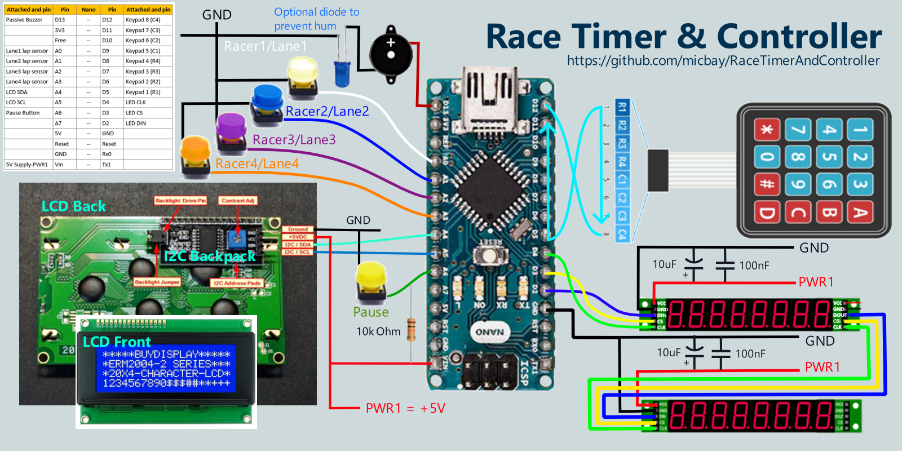
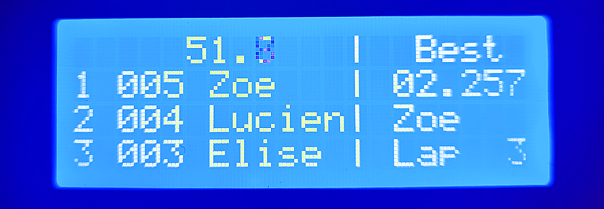

Download repository into a local folder with the same name as the contained `.ino` to use as an Arduino sketch.

---


# **<span style="color:red;font-size:72px"> -- README IN DRAFT -- </span>**

# **Arduino Race Timer and Lap Gate Controller**
This is an Arduino based project that implements a functional race game controller that can be used for timed racing games. The system consists of a main LCD display, a keypad for user input and menu selection, an 8 digit LED lap & timer display for each racer, and non-blocking audio for UI feedback and playing a unique victory song for each racer.

In the presented configuration, the lap sensing input is simulated using buttons, but can be adapted to be used with a myriad of simple, circuit completion, or other type sensing methods that can be implemented in the physical lap gate. The working demo of this project uses two paper clips integrated into a mechanical lap counter to create a simple, yet functional lap sensor.  
  
  
  

The implementation shown here is immediately useable for 1-4 player racing games. The original application for this controller was slot car racing, as such, the controller was designed expecting a dedicated lane/gate for each racer. The down side of this, if attempting to adapt for drone racing, is that each racer needs a dedicated gate, but in turn, this also means that the racing object is irrelevant and does not need to communicate its identity.

### **Prerequisites**  
This project involves a lot of different hardware and software concepts and implements some more intermediate to advanced code for Arduino.  
However, I have endevored to explain what I understand, in enough detail that someone with almost no experience can still implement and even modify to their own use.
It is expected the reader understands how to use the Arduino IDE, connect wires, and program boards. To get up to speed on those basics, there are many great resources from [Arduino](https://www.arduino.cc/en/Guide) and around the web, covering these topics exhaustively.

<br>

# **Hardware Configuration**  
All of the components are readily available and can be connected with basic jumper leads or simple conductor and header pin soldering.
> ***Note on Housing and Mechanical Interface** - This project only documents the functional electrical and software configuration. It can be wired, and used as illustrated for demonstration, however, for repeated, practical usage, the construction of a physical housing and the mechanical lane sensing interface are left up to the implementer to adapt to their specific use.*  
> ***Note on Reference Sources** - All links are for reference only and are not to be taken as an endorsement of any particular component supplier. I attempt to reference official Arduino resources whenever possible, but this is also not an endorsment for or against using the Arduino store.*

## **Parts for Race Controller**  
- [Arduino Nano](https://www.arduino.cc/en/pmwiki.php?n=Main/ArduinoBoardNano) (or equivalent microntroller module)
- [4 x 4 membrane keypad](https://duckduckgo.com/?q=4+x+4+membrane+keypad)
- [LCD2004 4 row x 20 character display](https://duckduckgo.com/?q=LCD2004A+4+x+20+I2C+backpack), with [I2C backpack](https://www.mantech.co.za/datasheets/products/LCD2004-i2c.pdf)
- 2-4 Chainable, [8-digit, 7-segment LED bar with integrated MAX7219](https://duckduckgo.com/?q=8-digit%2C+7-segment+LED+display)
- +5V Passive Buzzer or speaker
  - The 7-seg LEDs induced a hum on my buzzer, I used a diode on one lead to eliminate it.
- 2-4 lap sensors/switches/buttons
- 1 momentary button for in game pause and restart
  - 10k Ohm Pull-Up resistor
- Jumper leads to wire connections between peripherals & Arduino

## **PinOut Diagram for Wiring Arduino Nano**
(these are the pins used by this code, but can be re-arranged, if desired)  
<div style="color:orange;font-size:12px">  

|Attached        |Pin  |Nano|Pin  |Attached        |
|---------------:|----:|:--:|-----|----------------|
|Passive Buzzer  |D13  |\-- |D12  |Keypad 8 (C4)   |
|                |3V3  |\-- |D11  |Keypad 7 (C3)   |
|                |Free |\-- |D10  |Keypad 6 (C2)   |
|Lane1 lap sensor|A0   |\-- |D9   |Keypad 5 (C1)   |
|Lane2 lap sensor|A1   |\-- |D8   |Keypad 4 (R4)   |
|Lane3 lap sensor|A2   |\-- |D7   |Keypad 3 (R3)   |
|Lane4 lap sensor|A3   |\-- |D6   |Keypad 2 (R2)   |
|LCD SDA         |A4   |\-- |D5   |Keypad 1 (R1)   |
|LCD SCL         |A5   |\-- |D4   |LED CLK         |
|Pause Button    |A6   |\-- |D3   |LED CS          |
|                |A7   |\-- |D2   |LED DIN         |
|                |5V   |\-- |GND  |                |
|                |Reset|\-- |Reset|                |
|                |GND  |\-- |Rx0  |                |
|+5V Supply      |Vin  |\-- |Tx1  |                |
</div>  



## **Power Supply (+5V)**  
All devices in this build are powered from a +5V source. The displays should draw power from the source supply and not through the Arduino which cannot support enough current to run everything without flickering.
> ***Powering MAX7219 LED Bars** - Power for these can be daisy chained for the first 2 bars, but cascading 3 or more may require running the power directly to each subsequent display bar, but always keep all the signal lines daisy chained.*

> ***<span style="color:yellow"> Connect Arduino GND to external ground reference </span>** - Like many projects with higher power demands, this one uses an external power supply to get enough current for the dipslays; during development and programming, we will often have the USB plugged in as well. If we do not connect the Arduino GND to the power supply ground we run the risk of a reference mismatch that can cause intermittent errors, or the device to not work at all.  
> If we were to inadvertently find ourselves with the configuration shown here. It may appear to be ok on first look, but with the multi-meter we can see that there is a 1.9V differential between the two ground references when it should be reading close to 0.*
> 
> 
> Connecting our grounds to bring them to the same potential, as below, will eliminate the problem above.  
> 
> 
 
<br>

# **Software Configuration**  
In order to interact with our different peripherals, this project uses several existing [Arduino libraries](https://www.arduino.cc/reference/en/libraries/). Unless otherwise specified, these libraries can be downloaded the usual manner using the [Arduino Library Manager](https://docs.arduino.cc/software/ide-v1/tutorials/installing-libraries). Each library will be introduced with the hardware it's related to.

All custom project code is in the main Arduino sketch file. The only additional files are some .h files used to store different data constants making up custom characters and melodies.

The game controller code uses non-blocking techniques with port register interrupts on the lap detection sensor pins.

<br>

# **The Main Display (LCD2004 + I2C Backpack)**  
For the main display that provides the user interface, we are using a 4 row x 20 character LCD. LCD character displays are readily available in 2 or 4 rows, of 16 or 20 characters, fairly inexpensive, and simply to use. A 4 row x 20 character LCD display is the biggest commonly available, and is big enough to fit understandable menus and output for this application.  
In addition to providing the setup interface, the main display will also display a live leaderboard during a race. Hoewever, it's much too small to be used as a spectator display from a distance.

> ***LCD Part Numbers:** these types of character LCDs usually follow a Part Number pattern of 'LCDccrr', where rr = number of rows, and cc = the number of characters wide it is. (ie. LCD2004 = 4rows of 20ch).*

This display can be controlled directly using 13 Arduino pins. However, it is common to add a small 'backpack' board that will allow us to control these via I2C instead. This reduces the number of signal pins from 13 to just 2. This addition is so prevalent that most LCDs of this type, sold for use with Arduino, have an I2C backpack included.

[](https://www.mantech.co.za/datasheets/products/LCD2004-i2c.pdf)

> *Though a deeper understanding isn't necessary to use I2C in this project, one may find it helpful for troubleshooting, or if modifying the projcect hardware or software. These references can provide more details regarding I2C, and using the built-in Arduino 'Wire' library.*
> - [I2C Basics](https://rheingoldheavy.com/i2c-basics/) 
> - [The Arduino Wire Library](https://rheingoldheavy.com/arduino-wire-library/)

## **LCD Libraries and Initialization in Code:**  
In order to interact with the LCD screen, and update what is written, we are using the `hd44780` lcd library. This is a drop in replacement for the very common `LiquidCrystal` library. Since we are using an I2C backpack we must also include the built-in Arduino `Wire` library to manage the I2C communication.

  - [Wire](https://www.arduino.cc/en/Reference/Wire) - Built-in Arduino library used to setup and control I2C communication.
  - [hd44780](https://www.arduino.cc/reference/en/libraries/hd44780/) - Of the many available, we have chosen `hd44780` as our LCD display driver and API.  
    - `hd44780_I2Cexp.h` - Because we are using an LCD with an I2C backpack we need to also include the *hd44780_I2Cexp.h* io class which is installed with the *hd44780* library.

Declaration and Setup of LCD dispaly in `RaceTimerAndController.ino`
```cpp
// The 'Wire' library is for I2C, and is included in the Arduino installation.
// Specific implemntation is determined by the board selected in Arduino IDE.
#include <Wire.h>
// LCD driver libraries
#include <hd44780.h>						// main hd44780 header
#include <hd44780ioClass/hd44780_I2Cexp.h>	// i/o class for i2c backpack

//***** Variables for LCD 4x20 Display **********
// This display communicates using I2C via the SCL and SDA pins,
// which are dedicated by the hardware and cannot be changed by software.
// For the Arduino Nano, pin A4 is used for SDA, pin A5 is used for SCL.
// Declare 'lcd' object representing display:
// Use class 'hd44780_I2Cexp' for LCD using i2c i/o expander backpack (PCF8574 or MCP23008)
hd44780_I2Cexp lcd;
// Constants to set display size
const byte LCD_COLS = 20;
const byte LCD_ROWS = 4;

void setup(){
  --- other code ---
  // --- SETUP LCD DIPSLAY -----------------------------
  // Initialize LCD with begin() which will return zero on success.
  // Non-zero failure status codes are defined in <hd44780.h>
  int status = lcd.begin(LCD_COLS, LCD_ROWS);
  // If display initialization fails, trigger onboard error LED if exists.
  if(status) hd44780::fatalError(status);
  // Clear display of any residual data, ensure it starts in a blank state
  lcd.clear();
  --- other code ---
}
--- remaining program ---
```

<br>

## **Custom Characters**  
The `h78844` library supports up to 8 custom characters.  
To create a custom character, use a byte array to define the pixels of the character to turn on, or off. This online [LCD Custom Character Generator](https://maxpromer.github.io/LCD-Character-Creator/) makes it easy to get the array and supporting code.

<table>
<tr>
<td>
  <pre>
  byte Skull[] = {
    B00000,
    B01110,
    B10101,
    B11011,
    B01110,
    B01110,
    B00000,
    B00000
  };</pre>
</td>
<td>
  
</td>
</tr>
</table>

```cpp
  // With lcd object and byte array created, create character by assigning
  // the byte array to one of the 8 spots, using int 0-7
void setup(){
  ---- some code ----

  lcd.createChar(3, Skull);

  ---- some code ----
}

void loop(){
  ---- some code ----

  // To use the charactar write to lcd
  lcd.setCuror(0,0);
  lcd.write(3);

  ---- some code ----
}
  ```

<br>

# **Racer Lap Timers (8-digit, 7-seg LED Bar)**
This race controller is intended to support up to 4 racers. For each racer we have a dedicated lap sensor for tracking laps. Associated with that lap sensor is a dedicated display showing the racer's active lap number and running lap time.

The display must be able to fit a 3 digit lap count and a lap time with up to 4 significant digits. With this lap time digit width, we can support a display precision of at least 1 sec up to a 1 hour lap time, and as small as 1ms for lap times under 10 seconds.

***NOTE: Display precision has no impact on the precision of the recorded lap time. Laps of all durations will be captured with millisecond precision (0.000 sec).***

> 4 significant digits, sliding lap time display precision
> | Lap Time Range | Most Precise Display Format |
> |---|--|
> | time < 10 sec | 0.000 - 9.999 |
> | 10 sec <= time < 1 min |10.00 - 59.99 |
> | 1 min <= time < 10 min | 1.00.0 - 9.59.9 |
> | 10 min <= time < 1 hour | 10.00 - 59.59|

Because the primary purpose of this display is to show numbers, a 7-segment LED is a perfect, low budget choice. A 7-seg LED digit is made up of 8 standard LEDs arranged as a digit with a decimal.

As with the LCD, we could drive each LED directly from the Arduino, but the number of required pins is even worse. Each of the 8 LEDs that make up a single 7-segment digit would need its own pin. This means 7 digits x 8 LEDs is 56 pins just to drive the LEDs for a single racer.

[](https://www.electroschematics.com/arduino-segment-display-counter/)

## **The MAX7219 Serial LED Driver:**
### **Use Serial LED Driver to Minimize Pin Count**  
Luckily, our pin problem can be overcome by using a chip like the [MAX7219](https://www.14core.com/wp-content/uploads/2016/03/MAX7219-MAX7221.pdf), which can drive up to 64 LEDs while requiring only 3 signal pins from the Arduino. As such, it's common to find pre-assembled 7-segment LED bars having 4, or 8 digits, with an integrated MAX7219, like the one shown here. We'll use one of these 8 digit MAX7219 LED packages, as a lap timer, for each racer.


### **Chain The Lap Timer Displays**  
Another feature of the MAX7219, that makes these LED bars a good choice for this application, is the ability to cascade (i.e. daisy chain) a number of them together. By taking advantage of the MAX7219's no-op register we can update any digit of any of the racer's LED bars using the same 3 signal pins from the Arduino. The LED driver library will handle the implementation details regarding this, so it's not really necessary to understand more than we can connect them together and address any given digit individually.


### **Noise Sensitivity**  
The MAX7219 can be particularly sensitive to noise on its power input. If the power lines are clean, and direct, there may not be an issue, however, the MAXIM documentation on using the [MAX7219](https://www.14core.com/wp-content/uploads/2016/03/MAX7219-MAX7221.pdf), strongly recommends using a [bypass filter](https://www.electronicdesign.com/power-management/power-supply/article/21808839/3-ways-to-reduce-powersupply-noise), consisting of a 10&mu;F (polarized, electrolytic) and 100nF (i.e. 0.1&mu;F, #104) capacitors across the input voltage into the MAX7219 and ground. I can concur from experience that there will be random, intermittent issues, if the signal, and power supply to these displays managed properly.
 
|Bypass Diagram| Capacitor Diagram Symbol Review|
|:---:|:---:|
| | [](https://www.ifixit.com/Wiki/Troubleshhoting_logic_board_components) 

> *Note that some of the pre-assembled MAX LED packages may come with one or both of these bypass caps in place. My LEDs, like the ones picture above, came with the 100nF capactor, and I added a 10uF cap, in parallel, at the same solder points. If you do this, make sure to probe which end of C1 is connected to ground to get the polarity right.*   
> | 100nF Cap| Added 10uF|
> |---       |-----------|
> | | 

<br>

## LED Libraries and Initialization in Code:  
To drive the LED race timers, we will make use of the `LedControl` library which is specifically designed to operate these kinds of display packages. Similar to the LCD, this library allows us to update any given display digit with a straightforward write number or character API.
- [LedControl](https://www.arduino.cc/reference/en/libraries/ledcontrol/) - library supports MAX7219 & MAX7221 LED displays for the LED bars.

Declaration and Setup of LED dispalys in `RaceTimerAndController.ino`
```cpp
// library for 7-seg LED Bars
#include <LedControl.h>

// ***** 7-Seg 8-digit LED Bars *****
const byte PIN_TO_LED_DIN = 2;
const byte PIN_TO_LED_CS = 3;
const byte PIN_TO_LED_CLK = 4;
// When more than 2 MAX7219s are chained, additional chips
// may need direct power supply to avoid intermittent error.
// # of attached max7219 controlled LED bars
const byte LED_BAR_COUNT = 4;
// # of digits on each LED bar
const byte LED_DIGITS = 8;
// LedControl parameters (DataIn, CLK, CS/LOAD, Number of Max chips (ie 8-digit bars))
LedControl lc = LedControl(PIN_TO_LED_DIN, PIN_TO_LED_CLK, PIN_TO_LED_CS, LED_BAR_COUNT);


void setup() {
  --- some other code ---
  
  // --- SETUP LED 7-SEG, 8-DIGIT MAX7219 LED BARS ------
  // Initialize all the displays
  for(int deviceID = 0; deviceID < LED_BAR_COUNT; deviceID++) {
    // The MAX72XX is in power-saving mode on startup
    lc.shutdown(deviceID, false);
    // intensity range from 0-15, higher = brighter
    lc.setIntensity(deviceID, 8);
    // Blank the LED digits
    lc.clearDisplay(deviceID);
  }

  --- some other code ---
}
--- remaining program ---
```

## **LED Display Character Writing**  
Though the primary purpose of the racer's lap displays is to show running lap counts and times, we also need to be able to identify the which display is being used by which racer. The most direct way to do this is to write the racer name to the corresponding LED display on startup and racer selection.

However, a side effect of using 7-seg displays is that they cannot display all characters, and in many cases, of the characters that can be displayed, only a lower case, or upper case, option is available. 
> *7-segment displays cannot draw any version of the following characters:*  
> W's, M's, X's, K's, or V's

### **Customization of the `LedControl` Library's Character Table**  
The `LedControl` library, as it is downloaded, is missing some writable letters. To add them or to change how existing writable characters are written, we can edit the library's character table that contains the code value, representing the segments, to be displayed.

Normally it is not best practice to directly edit library files because next time they are updated these changes will get overwritten. However, in this case, Arduino libraries are rarely updated and it is not a difficult change to re-implement vs the hassle of making our own version of the library.

> ***Finding Arduino Library Files***  
> Built-in libraries that are installed as part of the Arduino IDE, are found in the Arduino IDE installation folder in a sub-directory called `libraries`. On windows this is in:  
> - *Note that `Wire` is special and not located here.*
> ```
> Built-in:
> C:\Program Files (x86)\Arduino\libraries
> ```  
> Add-on librarie (ones installed via the library manager) such as `LedControl.h`, are found in the sketchbook folder, the same folder sketches are saved, (this folder is called 'Arduino', not 'sketchbook').  
> By default, on windows, this is found in the user's `Documents` folder:
> ```
> Add-ons:
> C:\Users\userid\Documents\Arduino\libraries
> 
> LedControl.h is found in:
> C:\Users\userid\Documents\Arduino\libraries\LedControl\src
> 
> **Replace 'userid' with appropriate windows user profile name
> ```

To edit the displayed character shape, we can edit the code value of the corresponding index of the `charTable[]` array found in `LedControl.h`. We could also use any of the unwrittable characters as an alias for our own character, such as changing 'M' (i.e. ASCII 77) to be `B01001001`, which will draw a triple bar symbol when an 'M' character is commanded.

| Code Value: `B0abcdefg` | Edit `charTable[]` to update `LedControl.h` with more characters. |
|---|--|
|  | The requested character's [ASCII Value](https://www.ascii-code.com/) determines the index of the array, `charTable[]`, that has the code value, indicating which segments to light up, to draw the character. <br> For example, to set what is drawn when instructing the LED to draw a capital 'E', we look up its ASCII value, which is `69`. Then go to the value at `charTable[69]`, and set the code value to **`B01001111`**.  <br> Following the format, `B0abcdefg`, this will instruct segments a, d, e, f, and g to turn on. |

```cpp
const static byte charTable [] PROGMEM  = {
  //00  0         1         2          3        4         5         6         7
    B01111110,B00110000,B01101101,B01111001,B00110011,B01011011,B01011111,B01110000,
  //08  8         9         0         b          c        d         E         F
    B01111111,B01111011,B01110111,B00011111,B00001101,B00111101,B01001111,B01000111,
    B00000000,B00000000,B00000000,B00000000,B00000000,B00000000,B00000000,B00000000,
    B00000000,B00000000,B00000000,B00000000,B00000000,B00000000,B00000000,B00000000,
  //32                                                                        '
    B00000000,B00000000,B00000000,B00000000,B00000000,B00000000,B00000000,B00000010,
  //40                                                    -
    B00000000,B00000000,B00000000,B00000000,B10000000,B00000001,B10000000,B00000000,
  //48  0         1         2          3        4         5         6         7
    B01111110,B00110000,B01101101,B01111001,B00110011,B01011011,B01011111,B01110000,
  //56  8         9
    B01111111,B01111011,B00000000,B00000000,B00000000,B00000000,B00000000,B00000000,
  //64            A         B         C       D->d        E         F         G
    B00000000,B01110111,B01111111,B01001110,B00111101,B01001111,B01000111,B01011110,
  //72  H         I         J         K         L         M         N         O
    B00110111,B00000110,B01111100,B00000000,B00001110,B00000000,B00010101,B01111110,
  //80  P       Q->q      R->r        S       T->t        U         V         W
    B01100111,B01110011,B00000101,B01011011,B00001111,B00111110,B00000000,B00000000,
  //88  X         Y         Z         K                                       _
    B00000000,B00111011,B01101101,B00000000,B00000000,B00000000,B00000000,B00001000,
  //96          a->A        b         c         d        e        f->F        g
    B00000000,B01110111,B00011111,B00001101,B00111101,B01101111,B01000111,B01111011,
  //104 h         i         j         k         l         m         n         o
    B00010111,B00000100,B00111100,B00000000,B00000110,B00000000,B00010101,B00011101,
  //112 p         q         r       s->S        t         u         v        w
    B01100111,B01110011,B00000101,B01011011,B00001111,B00011100,B00000000,B00000000,
  //120 x         y       z->Z
    B00000000,B00111011,B01101101,B00000000,B00000000,B00000000,B00000000,B00000000
};
```


<br>

# **Playing Audio**  
## **Arduino [tone()](https://www.arduino.cc/reference/en/language/functions/advanced-io/tone/)**
Playing simple beeps and boops on the Arduino can be done with a single call to the built-in Arduino `tone()` function. Here we use `tone()` in a wrapper function, `Beep()`, that we can call when we want to play a feedback sound, such as when a keypad button is pressed.

```cpp
// A3 is a built in Arduino pin identifier
const byte buzzPin1 = A3;

void Beep() {
  // tone(pin with buzzer, freq in Hz, duration in ms)
  tone(buzzPin1, 4000, 200);
}
```

> *Notes regarding playing sounds using Arduino `tone()`.*
> - *The requested `tone()` plays in parallel once it is called, therefore it does not block the code loop while playing out the duration of a note.*
> - *`tone()` uses the same timer as pins 3 and 11. Therefore, one cannot `analogWrite()` or PWM on those pins while `tone()` is playing.*
> - *It is not possible to play the `tone()` function on two pins at the same time. Any in process tones must be stopped before starting a tone on a different pin.*  
> - *The minimum tone that can be generated is `31Hz`. A lower value can be submitted without error, but it won't play lower than `31Hz`.*
> - *The maximum frequency for UNO-nano class boards is `65535Hz`.*  
> - *The audible range for most people is `20Hz-20kHz`.*

## **Songs & Melodies**
To play a melody, we need to play a series of tones corresponding to the appropriate musical notes. Presented here are two common methods of coding and playing non-blocking audio melodies on the Arduino.

## **Method 1: `Notes[]` & `Lengths[]` Arrays ( `pitches.h` )**  
This is probably the most commonly used approach, as it is the most direct way to use `tone()` to play a melody. It is also the most versatile because there are no limits to the values used.

In this approach we will represent the musical notes that make up a melody, using two arrays, one array to hold the note frequencies, `Notes[]`, and one to hold the note lengths, `Lengths[]`, which will be used to determine each note's tone duration.

> ***Music Theory***  
> *Though most of the necessary concepts will be reviewed herein, some existing understanding of basic music structure and notation will be extremely helpful in grasping how playing melodies works.*  
> *Here are some resources to review or learn about musical notation and structure:*  
> - *[Musical Note Names: Organizing the Notes](https://www.allaboutmusictheory.com/piano-keyboard/music-note-names/)* - understanding 'C4', 'C5', etc.
> - *[Sheet Music Notation: The Complete Beginner’s Guide](https://yourcreativeaura.com/sheet-music-notation/) - good review on sheet notation from the ground up.*
> - *[How to Read Music Notes (Quick-learn cheat sheets)](https://cookband.files.wordpress.com/2012/02/how-to-read-music-notes-qlcss-pp1-9-dunn.pdf) - pdf cheat sheet of music notation.*
> - *[Open Music Theory](http://openmusictheory.com/) - an interactive, online, college level music theory text.*
> 
> *These are good articles for grasping key signatures, which is kind of a tricky topic.*
> - *[Key Signature and Music Staff](https://www.aboutmusictheory.com/key-signature.html)*
> - *[A Complete Guide to Music Key Signatures](https://www.merriammusic.com/school-of-music/piano-lessons/music-key-signatures/)*

### **Determining The Frequency Array ( `Notes[]` )**
To understand the relationship between our code and real music, we'll start by considering the keys of a piano. Each key plays a different note which is quantified as a particular frequency of sound waves. In this diagram we find the notes corresponding to each key, their frequencies in Hz, their octave number, and staff notation for the center notes.  

[](https://education.lenardaudio.com/en/03_db.html)

With this information we can construct a [pitches.h](pitches.h) file that defines a list of notes and their corresponding frequencies in Hz. 
A portion of `pitches.h` is shown here, defining C in octave 4 (aka middle C) = 262Hz, C4# = 277 Hz, D4 = 294Hz, and D4# = 311Hz:

```cpp
#define NOTE_C4 262
#define NOTE_CS4 277
#define NOTE_D4 294
#define NOTE_DS4 311
```

> ***The #define directive:**  
> In the `pitches.h` files, we are using the [`#define` preprocessor directive](https://www.ibm.com/docs/en/zos/2.3.0?topic=directives-define-directive). This is a macro definition syntax (e.g. `#define NOTE_C4 262`) that contains an identifier (e.g. `NOTE_C4`), and a replacement token-string, (e.g. `262`).  
> Just before the code is actually compiled, a preprocessor will replace all instances, in code, of the identifier, with the replacement token-string. In the case of `pitches.h` it will replace a given note id with the integer frequency in Hz. This is to be distinguished from using a constant variable.*

Using the notes defined in `pitches.h`, we can build an array of the notes that make up a melody. For example, we can take the basic C-Major Scale:

 C • D • E • F • G • A • B:


and record it in a `Notes[]` array, as such:
- *Storing in `PROGMEM` is optional*
```cpp
const int cMajorScaleNotes[] PROGMEM = {
  NOTE_C4, NOTE_D4, NOTE_E4, NOTE_F4, NOTE_G4, NOTE_A4, NOTE_B4
};
```
### **Determining The Lengths Array ( `Lengths[]` )**
Each note in the `Notes[]` arrary has a note length that must be accounted for. We can store this note length in a second array, `Lengths[]`, where `Note[i]` = a note's freq and `Lengths[i]` = the corresponding length. 

The length of a note, or rest, in music is measured in number of beats and recorded on sheet music as follows:


Ultimately we will need a millisecond integer value, to input as the duration into the `tone()`. We could store this directly into `Lengths[]`, however, it is more musically natural, and more versatile to capture a the note length's beat notation instead. This allows the same song data to be played at different tempos, using the same code.

Most often, we find note length in a `Lengths[]` array using just the note length divisor value, as such:

- `1` = whole note
- `2` = half note
- `4` = quarter note
- `8` = eight note
- `16` = 1/16th note
- etc.

Negative numbers are used to represent dot notes which are 1.5 * note length.
- `-1` = 1 + 1/2 = 3/2 note
- `-2` = 1/2 + 1/4 = 3/4 note

All of the notes in our C-Major Scale are quarter notes, so using the note length notation, we can finish our C-major Scale arrays as follows:

```cpp
const int cMajorScaleNotes[] PROGMEM = {
  NOTE_C4, NOTE_D4, NOTE_E4, NOTE_F4, NOTE_G4, NOTE_A4, NOTE_B4
};
const int cMajorScaleLengths[] PROGMEM = {
  4, 4, 4, 4, 4, 4, 4
};
```
In order to convert our note lengths into millisecond durations, we need to establish a **tempo**.

How long a beat lasts in real time is established by the tempo of the melody in **beats per minute (bpm)**. The tempo on a sheet of music is sometimes declared by assigning a bpm to a note. Often this is the quarter note since a quarter note is equal to 1 beat, but it doesn't have to be.  

This indicates the tempo is 70bpm:

  
Usually however, instead of a numerical bpm, an Italian term (sometimes French, German, or English) describing the speed is used.  
This table interprets these terms into bpm and duration: ([Music Note Length Calculator](https://rechneronline.de/musik/note-length.php))
| Tempo       | Speed                     |bpm         | ms/beat      |
| ----------- | --------------------------|----------- | :-----------:|
| Larghissimo | very, very, slow          |20 or lower | \> 3000      |
| Grave       | slow and solemn           |20 to 40    | 3000 - 1500  |
| Lento       | slowly                    |40 to 45    | 1500 - 1333  |
| Largo       | broadly                   |40 to 60    | 1333 - 1000  |
| Larghetto   | rather broadly            |60 to 66    | 1000 - 909   |
| Adagio      | slow and stately          |66 to 76    | 909 - 789    |
| Andante     | at a walking pace         |76 to 108   | 789 - 556    |
| Moderato    | moderately                |108 to 120  | 556 - 500    |
| Allegro     | fast, quickly, and bright |120 to 168  | 500 - 357    |
| Vivace      | lively and fast           |138 to 168  | 435 - 357    |
| Presto      | extremely fast            |168 to 200  | 357 - 300    |
| Prestissimo | even faster than Presto   |200 and up  | < 300        |

To account for tempo we could use the same tempo for everything and hard code it into the `PlayNote()` function, but it's easy enough to be flexible and let each song have its own tempo variable.

```cpp
const int cMajorScaleTemp = 120;
```

Lastly, because in C++ it can be challenging to know how many elements are in an array, if using pointers and passing them into functions, it's worth generating a `count` variable right away for referencing the array size. This will be used by the play function to determine when the melody is over.

So the final, full melody definition consists of 2 integer arrays, and 2 integer constants.

```cpp
const int cMajorScaleNotes[] PROGMEM = {
  NOTE_C4, NOTE_D4, NOTE_E4, NOTE_F4, NOTE_G4, NOTE_A4, NOTE_B4
};
const int cMajorScaleLengths[] PROGMEM = {
  4, 4, 4, 4, 4, 4, 4
};
// tempo in beats per minute
const int cMajorScaleTempo = 120;
// getting note count for easy reference later
const int cMajorScaleCount = sizeof(cScaleNotes)/sizeof(int); 
```

## **Playing the Melody Arrays**
Now that we have a melody transcribed into an array of frequencies and durations, in order to play it we need to cycle through the arrays, playing each note in time. Because we want to be able to do other things while the song is playing we will need to track passing time so we know when to play the next note.

Because we have many songs to play we'll create a set of global reference variables that we can use to point to different song data variables. We use pointers to the data arrays instead of a passing copies, to save memory, and because we have songs of different sizes.

```cpp
// *** This section for using Note and Lengths arrays for songs
// Globals for holding the current melody data references.
int *playingNotes;
int *playingLengths;                                                            
int playingTempoBPM = 135;
int playingMelodySize = 0;
// flag to indicate to the main program loop whether a melody is in process
// so it should execute the 'PlayNote()' function with the current melody parameters.
bool melodyPlaying = false;
// Holds the timestamp of last tone played so timing of next note in melody can be determined
unsigned long lastNoteMillis = 0;
// index of the current note to play of 'playing...' song.
int melodyIndex = 0;
// time in ms between beginning of last note and when next note should be played.
int noteDelay = 0;

// Function to play the current note index of a melody using 'tone()'.
// We want to pass all the variables instead of depending on their globality.
// This function returns, in ms, how long to wait before playing following note.
int PlayNote(int *songNotes, int *songLengths, int curNoteIdx, byte tempoBPM){

  int noteDuration;
  int noteLength = pgm_read_word(&songLengths[curNoteIdx]);

  // If tempo = 0 then use note length directly as ms duration
  if(tempoBPM == 0){
    noteDuration = noteLength;
  } else {
    // Otherwise calculate duration in ms from bpm:
    // (60,000ms/min)/Xbpm * 4beats/note * 1/notelength
    // Make sure equation has a decimal or result will be incorrect integer math.
    if (noteLength > 0){
      noteDuration = (60000 / tempoBPM) * 4 * (1.0 / noteLength);
    } else {
      // If note length is negative, then it's dotted so add extra half length.
      noteDuration = 1.5 * (60000 / tempoBPM) * 4 * (1.0 / abs(noteLength));
    }
  }

  // Record millisecond timestamp at start of new note.
  lastNoteMillis = millis();
  // The played notes have no transition time or strike impulse.
  // Played as written, each note sounds unaturally flat and run together.
  // Adding a small break between notes makes the melody sound better.
  // This can be done by slightly shortening the tone played vs the song temp.
  // or making the gap between notes slightly longer than the note length.
  // In which case the actual tempo will be slightly slower than the set tempo.
  // Here we'll factor the played tone down by 10% and keeping the tempo as set.
  // Play note:
  tone(buzzPin1, pgm_read_word(&songNotes[curNoteIdx]), .9*noteDuration);
  melodyIndex++;
  // If we have reached the end of the melody array then
  // flip playing flag off and reset tracking variables for next melody.
  if(melodyIndex == playingMelodySize){
    melodyPlaying = false;
    melodyIndex = 0;
    noteDelay = 0;
    playingMelodySize = 0;
  }
  return noteDuration;
}

void loop() {
  if(melodyPlaying){
    if(millis() - lastNoteMillis >= noteDelay){
      noteDelay = PlayNote(playingNotes, playingLengths, melodyIndex, false);
    }
  }

  --- other code ---
  // To play a song we set the flag to true and re-assign song pointer to desired tune.
  melodyPlaying = true;
  playingNotes = takeOnMeNotes;
  playingLengths = takeOnMeLengths;
  playingMelodySize = takeOnMeCount;
  playingTempoBPM = takeOnMeTempo;

  --- other code ---
}
```

## **Example Transcribing *'Take On Me'* Into Playable Arrays**
To illustrate the process, we will transcribe the intro to Take On Me by Aha! Here are the first 12 meausres (bar 1 repeated twice, and 2nd bar) of the sheet music.


Looking at the first measure we see that the key signature is for the key of A Major. This means that all F5, C5, and G5 notes are sharp, as is indicated by the key signature sharp symbols on those lines.


In addition to our notes and note lengths we also see the tempo is 'Fast', which on our chart is around 120-168 bpm, listening it sounds on the fast end of that scale, so something around 160 bpm, is probably good.

This first measure gives us everything we need to make our melody variables and populate the first notes.
```cpp
const int takeOnMeNotes[] = {
  NOTE_FS5, NOTE_FS5, NOTE_D5, NOTE_B4, 0, NOTE_B4, 0, NOTE_E5
};
const int takeOnMeLengths[] = {
  8, 8, 8, 8, 8, 8, 8, 8
};
const int takeOnMeTempo = 160;
const int takeOnMeSize = sizeof(takeOnMeNotes)/sizeof(int); 
```

Finishing the rest of the notes in the intro we get a full trancription of the sheet snippet.

```cpp
const int takeOnMeNotes[] PROGMEM = {
  NOTE_FS5, NOTE_FS5, NOTE_D5, NOTE_B4, 0, NOTE_B4, 0, NOTE_E5,
  0, NOTE_E5, 0, NOTE_E5, NOTE_GS5, NOTE_GS5, NOTE_A5, NOTE_B5, 
  NOTE_A5, NOTE_A5, NOTE_A5, NOTE_E5, 0, NOTE_D5, 0, NOTE_FS5, 
  0, NOTE_FS5, 0, NOTE_FS5, NOTE_E5, NOTE_E5, NOTE_FS5, NOTE_E5,

  NOTE_FS5, NOTE_FS5, NOTE_D5, NOTE_B4, 0, NOTE_B4, 0, NOTE_E5,
  0, NOTE_E5, 0, NOTE_E5, NOTE_GS5, NOTE_GS5, NOTE_A5, NOTE_B5, 
  NOTE_A5, NOTE_A5, NOTE_A5, NOTE_E5, 0, NOTE_D5, 0, NOTE_FS5, 
  0, NOTE_FS5, 0, NOTE_FS5, NOTE_E5, NOTE_E5, NOTE_FS5, NOTE_E5,

  NOTE_FS5, NOTE_FS5, NOTE_D5, NOTE_B4, 0, NOTE_B4, 0, NOTE_E5,
  0, NOTE_E5, 0, NOTE_E5, NOTE_GS5, NOTE_GS5, NOTE_A5, NOTE_B5, 
  NOTE_A5, NOTE_A5, NOTE_A5, NOTE_E5, 0, NOTE_D5, 0, NOTE_FS5, 
  0, NOTE_FS5, 0, NOTE_FS5, 0
};
const int takeOnMeLengths[] PROGMEM = {
  8, 8, 8, 8, 8, 8, 8, 8,
  8, 8, 8, 8, 8, 8, 8, 8,
  8, 8, 8, 8, 8, 8, 8, 8,
  8, 8, 8, 8, 8, 8, 8, 8,

  8, 8, 8, 8, 8, 8, 8, 8,
  8, 8, 8, 8, 8, 8, 8, 8,
  8, 8, 8, 8, 8, 8, 8, 8,
  8, 8, 8, 8, 8, 8, 8, 8,

  8, 8, 8, 8, 8, 8, 8, 8,
  8, 8, 8, 8, 8, 8, 8, 8,
  8, 8, 8, 8, 8, 8, 8, 8,
  8, 8, 8, 8, 2
};
const int takeOnMeTempo = 160;
const int takeOnMeSize = sizeof(takeOnMeNotes)/sizeof(int);
```
## **Sources of tone() Array Melodies**
[robsoncouto/arduino-songs](https://www.smssolutions.net/tutorials/smart/rtttl/) is probably the biggest library of songs in this format I found. These are written as a single array of interwoven note, length, note, length, pattern. However, they can be quickly be converted into the 2 array format, used in this project, by making a copy and using search-replace to replace a few, often repeated notes and durations with nothing.

Otherwise, most available melodies in this format are one-off single song projects and must be searched for individually.

<br>

---  

## **Method 2: Ringtone RTTTL Format**  
RTTTL stands for Ring Tone Text Transfer Language which is a string based format developed by Nokia that can be interpreted and played as a ringtone. This format is no longer used by phones, but the internet has libaries of thousands of songs encoded with it. Making it the preferred method for this project.

### **The RTTTL String**  
The RTTTL string is made up of 3 parts seperated by colons ':'


  - **Title** - up to 100, [ISO-8859-1](https://www.mobilefish.com/tutorials/character_encoding/character_encoding_quickguide_iso8859_1.html) characters allowed.
  - **Parameters**  
    ```
    d = duration (default = 4 if not present)
      Allowed values
        1 = whole note
        2 = half note
        4 = quarter note
        8 = eighth note
        16 = sixteenth note
        32 = thirty-second note

    o = octave (default = 6 if not present)
      Allowed Values = 4, 5, 6, or 7
    
    b = tempo, beats per minute (default = 63bpm)
      Allowed Values = 25, 28, 31, 35, 40, 45, 50, 56, 63, 70, 80, 90, 100, 112, 125, 140, 160, 180, 200, 225, 250, 285, 320, 355, 400, 450, 500, 565, 635, 715, 800 and 900
    ```
  - **Notes** - the last part of the RTTTL string is a comma seperated list of encoded notes using a duration-note-octave and optional dot, pattern.
    ```
    Tone Pattern: duration-note-octave(.)
    . an optional dotted note is 1.5 x duration
    p = pause
    if no duration or octave, use default

    Examples:
    8f#5 = 1/8th note of F sharp, in the 5th octave
    d4 = default note length, of D, in the 4th octave
    8p = 1/8th note, rest 
    8b = 1/8th note, of B, in default octave
    4e5. = 3/8th note, of E, in the 5th octave
    ```

## **Playing RTTTL Strings**  
To play RTTTL strings we can use the [PlayRtttl](https://github.com/ArminJo/PlayRtttl) library. This library can be used to play in a non-blocking manner, but must be called/checked-on every program loop.
```cpp
// library for playing RTTTL song types
#include <PlayRtttl.h>
// file of RTTTL song definition strings.
// Because these strings are stored in PROGMEM we must also include 'avr/pgmspace.h' to access them.
#include "RTTTL_songs.h"

// Library to support storing/accessing constant variables in PROGMEM
#include <avr/pgmspace.h>

const char takeOnMe[] PROGMEM = "takeOnMe1:d=8,o=5,b=160:f#,f#,d,b4,p,b4,p,e,p,e,p,e,g#,g#,a,b";
const byte buzzPin1 = 13;


void setup(){
  --- other code ---

  // to start playing an RTTL encoded song
  startPlayRtttlPGM(buzzPin1, takeOnMe);

  --- other code ---
}


void loop(){
  --- other code ---

  // Must call this function every loop to keep song playing
  updatePlayRtttl();
  // to stop an song in process use the stop function
  stopPlayRtttl();
  
  --- other code ---
}
```
## **Sources of tone() Array Melodies**  
- [Online List of RTTTL Online Sources](https://www.srtware.com/index.php?/ringtones/findringtones.php)
- [Picaxe Ringtone Download](https://picaxe.com/rtttl-ringtones-for-tune-command/) - RTTTL zip downloads 10,000+ songs
- [dglaude/xmas.py](https://gist.github.com/dglaude/71525a07f5e24888a3f098fba3abf29b) - RTTTL christmas songs

<br>

---
# **Race Controller Operation**
## Main Menu
When the controller boots up it will display the main menu screen. This is a small system, so the menu layer is only one layer deep from here. Pressing the corresponding keys on the attached keypad will navigate the menu structure and allow input for changing settings.


---
> **\* Asterisk Key**
>   - In all sub-menus, the '*' key will exit back to the main menu.
>   -During a live race, if the race is in the 'Paused' state, pressing `*` will end the race and open the **Top Results Menu**.
---

## Main Menu -> A| Select Racers
Pressing the `A` key, from the main menu will go to the **Select Racers Menu**. On this menu, selecting the key corresponding to the racer will cycle through the available names and play a sample of the victory song corresponding to the selected name.
  - Racer names and victory songs are a from a hard-coded list. Edit the list in software to change options. Remember that the timer LED bars will not display certain characters, when choosing racer names.
  - Two racers cannot have the same name. To select a name used by anoter racer #, cycle the other racer # to a new name, then choose newly freed name.
  - **Disabled Lanes** - If a lane sensor is disabled then it will show up as `-Off-` in the Select Racers menu. To select a name for a disabled racer, go to the **Settings Menu**, and enable the desired lanes, then return to this menu.


## Main Menu -> B| Change Settings
Pressing the `B` key, from the main menu will bring up the **Settings Menu**. On this menu the general race settings can be adjusted. These include:
- Press `A`, to activate edit, then use keypad numbers to enter mm:ss. Race time is only used in a 'Timed' race type, where the winner is the one who finishes the most laps in the set amount of time.
- Press `B`, to activate edit, then enter the number of laps. This setting is only used by the 'Standard' race type where the first to finish the set number of laps is the winner.
- Pressing `1-4` will toggle the enabled status of the give lane/racer number.
- Pressing `0` will disable all of the lanes/racers.
- Press `*` to return to main menu.


## Main Menu -> C| Start a Race
Pressing `C` from the Main Menu will bring up the **Race Start Menu**. From this menu we can start one of the two types of races.
  - Pressing `A` will begin a 'Standard', first to finish X laps race.
  - Pressing `B` will begin a 'Timed', most laps before time runs out race.
  - Pressing `D` to activate edit, then use number pad to change the number of seconds the pre-start countdown lasts (0-30).





## Main Menu -> D| See Results  
Pressing `D` from the Main Menu will bring up the **Results Menu**. Initially, on bootup, before a race is run there are no results to display.


